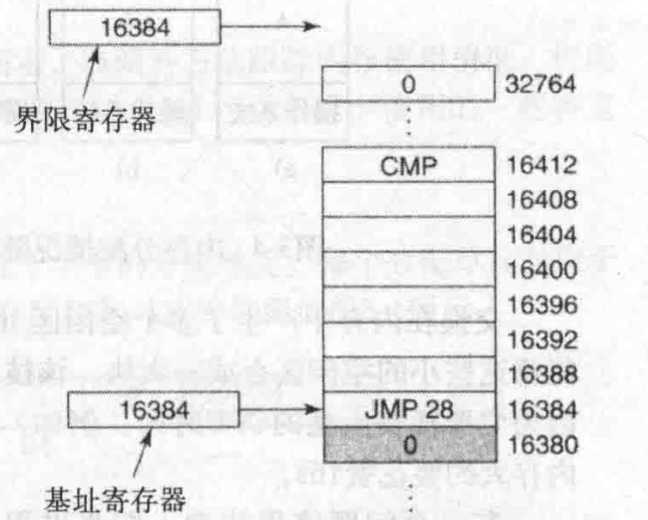
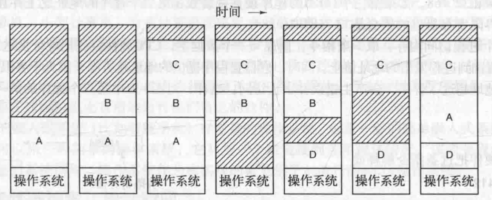
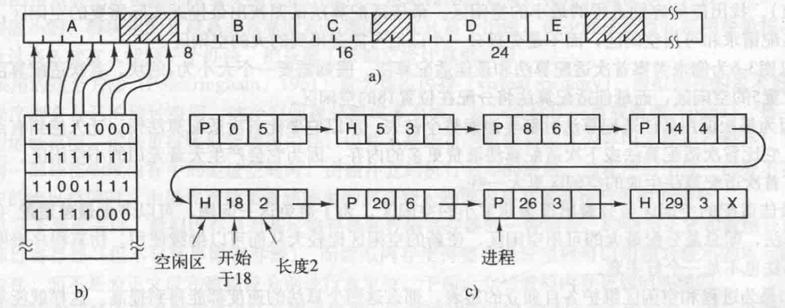
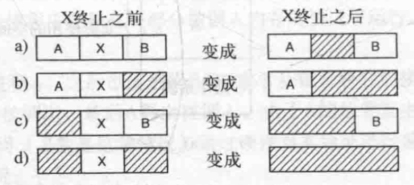

# 目录

   * [内存管理](#内存管理)
      * [一种存储抽象：地址空间](#一种存储抽象地址空间)
         * [地址空间的概念](#地址空间的概念)
            * [基于寄存器与界限寄存器](#基于寄存器与界限寄存器)
         * [交换技术](#交换技术)
         * [空闲内存管理](#空闲内存管理)
            * [使用位图存储管理](#使用位图存储管理)
            * [使用链表存储管理](#使用链表存储管理)

# 内存管理

经过多年的探索，人们提出了**分层存储器体系**（memory hierarchy）的概念，即在这个体系中，计算机有若干兆（MB）快速、昂贵且易失性的高速缓存（cache），数千兆（GB）速度与价格适中且同样易失性的内存，以及几兆兆（TB）低速、廉价、非易失性的磁盘存储。操作系统的工作是将这个存储体系抽象为一个有用的模型并管理这个抽象模型

操作系统中管理分层存储器体系的部分称为**存储管理器**（memory manager）。它的任务是有效地管理内存，即记录哪些内存是正在使用的，哪些内存是空闲的，在进程需要时为其分配内存，在进程使用完后释放内存

## 一种存储抽象：地址空间

总之，把物理地址暴露给进程会带来下面几个严重问题。第一，如果用户程序可以寻址内存的每个字节，它们就可以很容易地（故意地或偶然地）破坏操作系统，从而使系统慢慢地停止运行（除非使用特殊的硬件进行保护，如IBM360的锁键模式）。即使在只有一个用户进程运行的情况下，这个问题也是存在的。第二，使用这种模型，想要同时运行（如果只有一个CPU就轮流执行）多个程序是很困难的。在个人计算机上，同时打开几个程序是很常见的（一个文字处理器，一个邮件程序，一个网络浏览器），其中一个当前正在工作，其余的在按下鼠标的时候才会被激活。在系统中没有对物理内存的抽象的情况下，很难实现上述情景，因此，我们需要其他办法

### 地址空间的概念

要使多个应用程序同时处于内存中并且不互相影响，需要解决两个问题：**保护和重定位**。我们来看一个原始的对前者的解决办法，它曾被用在IBM360上：给内存块标记上一个保护键，并且比较执行进程的键和其访问的每个内存字的保护键。然而，这种方法本身并没有解决后一个问题，虽然这个问题可以通过在程序被装载时重定位程序来解决，但这是一个缓慢且复杂的解决方法

一个更好的办法是创造一个新的存储器抽象：**地址空间**。就像进程的概念创造了一类抽象的CPU以运行程序一样，地址空间为程序创造了一种抽象的内存。**地址空间是一个进程可用于寻址内存的一套地址集合。每个进程都有一个自己的地址空间，并且这个地址空间独立于其他进程的地址空间（除了在一些特殊情况下进程需要共享它们的地址空间外）**

比较难的是给每个程序一个自己独有的地址空间，使得一个程序中的地址28所对应的物理地址与另一个程序中的地址28所对应的物理地址不同。下面我们将讨论一个简单的方法，这个方法曾经很常见，但是在有能力把更复杂（而且更好）的机制运用在现代CPU芯片上之后，这个方法就不再使用了

#### 基于寄存器与界限寄存器

这个简单的解决办法是使用**动态重定位**，简单地把每个进程的地址空间映射到物理内存的不同部分。从CDC6600(世界上最早的超级计算机)到Intel8088(原始 IBM PC的心脏)，所使用的经典办法是给每个CPU配置两个特殊硬件寄存器，通常叫作**基址寄存器**和界限寄存器。当使用基址寄存器和界限寄存器时，程序装载到内存中连续的空闲位置且装载期间无须重定位，如下图所示。当一个进程运行时，程序的起始物理地址装载到基址寄存器中，程序的长度装载到界限寄存器中。在下图中，当第一个程序运行时，装载到这些硬件寄存器中的基址和界限值分别是0和16384。当第二个程序运行时，这些值分别是16384和32768。如果第三个16KB的程序被直接装载在第二个程序的地址之上并且运行，这时基址寄存器和界限寄存器里的值会是32768和16384

    

每次一个进程访问内存，取一条指令，读或写一个数据字，CPU硬件会在把地址发送到内存总线前自动把基址值加到进程发出的地址值上。同时，它检查程序提供的地址是否等于或大于界限寄存器里的值。如果访问的地址超过了界限，会产生错误并中止访问。这样，对上图中第二个程序的第一条指令，程序执行**JMP 28**指令，但是硬件把这条指令解释成**JMP 16412**

使用基址寄存器和界限寄存器是给每个进程提供私有地址空间的非常容易的方法，因为每个内存地址在送到内存之前，都会自动先加上基址寄存器的内容。在很多实际系统中，对基址寄存器和界限寄存器会以一定的方式加以保护，使得只有操作系统可以修改它们。在CDC6600中就提供了对这些寄存器的保护，但在Intel 8088中则没有，甚至没有界限寄存器。但是，Intel8088提供了多个基址寄存器，使程序的代码和数据可以被独立地重定位，但是没有提供引用地址越界的预防机制

使用基址寄存器和界限寄存器重定位的缺点是，每次访问内存都需要进行加法和比较运算。比较运算可以做得很快，但是加法运算由于进位传递时间的问题，在没有使用特殊电路的情况下会显得很慢

### 交换技术

如果计算机物理内存足够大，可以保存所有进程，那么之前提及的所有方案都或多或少是可行的。但实际上，所有进程所需的RAM数量总和通常要远远超出存储器能够支持的范围。在一个典型的Windows，OSX或Linux系统中，在计算机完成引导后会启动50~100个甚至更多的进程。例如，当一个Windows应用程序安装后，通常会发出一系列命令，使得在此后的系统引导中会启动一个仅仅用于查看该应用程序更新的进程。这样一个进程会轻易地占据5~10MB的内存。其他后台进程还会查看所收到的邮件和进来的网络连接，以及其他很多诸如此类的任务。并且，这一切都发生在第一个用户程序启动之前。当前重要的应用程序如Photoshop一启动就轻易地占据500MB内存，而开始处理数据后可能需要数千兆字节（GB）的空间。因此，把所有进程一直保存在内存中需要巨大的内存，如果内存不够，就做不到这一点

有两种处理内存超载的通用方法。最简单的策略是**交换**（swapping）技术，即把一个进程完整调入内存，使该进程运行一段时间，然后把它存回磁盘。空闲进程主要存储在磁盘上，所以当它们不运行时就不会占用内存（尽管其中的一些进程会周期性地被唤醒以完成相关工作，然后就又进入睡眠状态）。另一种策略是虚拟内存（virtual memory），该策略甚至能使程序在只有一部分被调人内存的情况下运行

下面先讨论交换技术

交换系统的操作如下图所示。开始时内存中只有进程A。之后创建进程B和C或者从磁盘将它们换入内存。图3-4d显示A被交换到磁盘。然后D被调人，B被调出，最后A再次被调入。由于A的位置发生变化，所以在它换人的时候通过软件或者在程序运行期间（多数是这种情况）通过硬件对其地址进行重定位

    

交换在内存中产生了多个空闲区（hole，也称为空洞），通过把所有的进程尽可能向下移动，有可能将这些小的空闲区合成一大块。该技术称为**内存紧缩**（memory compaction）。通常不进行这个操作因为它要耗费大量的CPU时间。例如，一台有16GB内存的计算机可以每8ns复制8个字节，它紧缩全部内存大约要花费16s

有一个问题值得注意，即当进程被创建或换入时应该为它分配多大的内存。若进程创建时其大小是固定的并且不再改变，则分配很简单，操作系统准确地按其需要的大小进行分配，不多也不少

**但是如果进程的数据段可以增长，例如，很多程序设计语言都允许从堆中动态地分配内存，那么当进程空间试图增长时，就会出现问题**。若进程与一个空闲区相邻，那么可把该空闲区分配给进程供其增大。另一方面，若进程相邻的是另一个进程，那么要么把需要增长的进程移到内存中一个足够大的区域中去，要么把一个或多个进程交换出去，以便生成一个足够大的空闲区。若一个进程在内存中不能增长，而且磁盘上的交换区也已满了，那么这个进程只有挂起直到一些空间空闲（或者可以结束该进程）

### 空闲内存管理

在动态分配内存时，操作系统必须对其进行管理。一般而言，有两种方法跟踪内存使用情况：**位图**和空闲区链表

#### 使用位图存储管理

使用位图方法时，内存可能被划分成小到几个字或大到几千字节的分配单元。每个分配单元对应于位图中的一位，0表示空闲，1表示占用（或者相反）。一块内存区和其对应的位图如下图所示

    

a : 一段有5个进程和3个空闲区的内存，刻度表示内存分配单元，阴影区域表示空闲(在位图中用0表示)

b : 对应的位图

c : 用空闲区链表表示的同样的信息

分配单元的大小是一个重要的设计因素。分配单元越小，位图越大。然而即使只有4个字节大小的分配单元，32位的内存也只需要位图中的1位。32n位的内存需要n位的位图，所以位图只占用了1/32的内存。若选择比较大的分配单元，则位图更小。但若进程的大小不是分配单元的整数倍，那么在最后一个分配单元中就会有一定数量的内存被浪费了

因为内存的大小和分配单元的大小决定了位图的大小，所以它提供了一种简单的利用一块固定大小的内存区就能对内存使用情况进行记录的方法。这种方法的主要问题是，在决定把一个占k个分配单元的进程调入内存时，存储管理器必须搜索位图，在位图中找出有k个连续0的串。查找位图中指定长度的连续0串是耗时的操作（因为在位图中该串可能跨越字的边界），这是位图的缺点

#### 使用链表存储管理

另一种记录内存使用情况的方法是，维护一个记录已分配内存段和空闲内存段的链表。其中链表中的一个结点或者包含一个进程，或者是两个进程间的一块空闲区。可用上图c所示的段链表来表示上图a所示的内存布局。链表中的每一个结点都包含以下域：**空闲区（H）或进程（P）的指示标志、起始地址、长度和指向下一结点的指针**

在本例中，段链表是按照地址排序的，其好处是当进程终止或被换出时链表的更新非常直接。一个要终止的进程一般有两个邻居（除非它是在内存的最底端或最顶端），它们可能是进程也可能是空闲区，这就导致了下图所示的四种组合。在上图a中更新链表需要把P替换为H，在下图(b)和下图(c)中两个结点被合并为一个，链表少了一个结点，在下图(d)中三个结点被合并为一个，从链表中删除了两个结点

    

进程表中表示终止进程的结点中通常含有指向对应于其段链表结点的指针，因此**段链表使用双向链表可能要比单向链表更方便**。这样的结构更易于找到上一个结点，并检查是否可以合并

当按照地址顺序在链表中存放进程和空闲区时，有几种算法可以用来为创建的进程（或从磁盘换入的已存在的进程）分配内存。这里，假设存储管理器知道要为进程分配多少内存。最简单的算法是**首次适配**（**first fit**）算法。**存储管理器沿着段链表进行搜索，直到找到一个足够大的空闲区，除非空闲区大小和要分配的空间大小正好一样，否则将该空闲区分为两部分，一部分供进程使用，另一部分形成新的空闲区**。首次适配算法是一种速度很快的算法，因为它尽可能少地搜索链表结点

对首次适配算法进行很小的修改就可以得到**下次适配**（**next fit**）算法。它的工作方式和首次适配算法相同，不同点是每次找到合适的空闲区时都记录当时的位置，以便在下次寻找空闲区时从上次结束的地方开始搜索，而不是像首次适配算法那样每次都从头开始。**Bays（1977）的仿真程序证明下次适配算法的性能略低于首次适配算法**

另一个著名的并广泛应用的算法是**最佳适配**（best fit）算法。**最佳适配算法搜索整个链表（从开始到结束），找出能够容纳进程的最小的空闲区。最佳适配算法试图找出最接近实际需要的空闲区，以最好地匹配请求和可用空闲区，而不是先拆分一个以后可能会用到的大的空闲区**

以上上图为例来考察**首次适配算法**和最佳适配算法。假如需要一个大小为2的块，首次适配算法将分配在位置5的空闲区，而最佳适配算法将分配在位置18的空闲区

因为每次调用最佳适配算法时都要搜索整个链表，所以它要比首次适配算法慢。**让人感到有点意外的是，它比首次适配算法或下次适配算法浪费更多的内存，因为它会产生大量无用的小空闲区**。一般情况下，首次适配算法生成的空闲区更大一些

最佳适配的空闲区会分裂出很多非常小的空闲区，为了避免这一问题，可以考虑**最差适配**（worst fit）算法，即总是分配最大的可用空闲区，使新的空闲区比较大从而可以继续使用。**仿真程序表明最差适配算法也不是一个好主意**

另一种分配算法称为**快速适配**（quick fit）算法，它为那些常用大小的空闲区维护单独的链表。例如，有一个n项的表，该表的第一项是指向大小为4KB的空闲区链表表头的指针，第二项是指向大小为8KB的空闲区链表表头的指针，第三项是指向大小为12KB的空闲区链表表头的指针，以此类推。像21KB这样的空闲区既可以放在20KB的链表中，也可以放在一个专门存放大小比较特别的空闲区的链表中

快速适配算法寻找一个指定大小的空闲区是十分快速的，但它和所有将空闲区按大小排序的方案一样，都有一个共同的缺点，即在一个进程终止或被换出时，寻找它的相邻块并查看是否可以合并的过程是非常费时的。如果不进行合并，内存将会很快分裂出大量的进程无法利用的小空闲区
