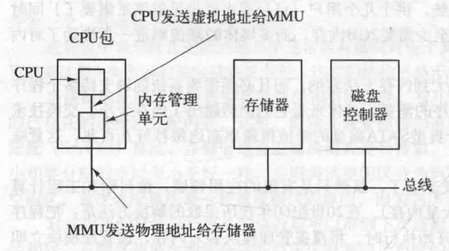
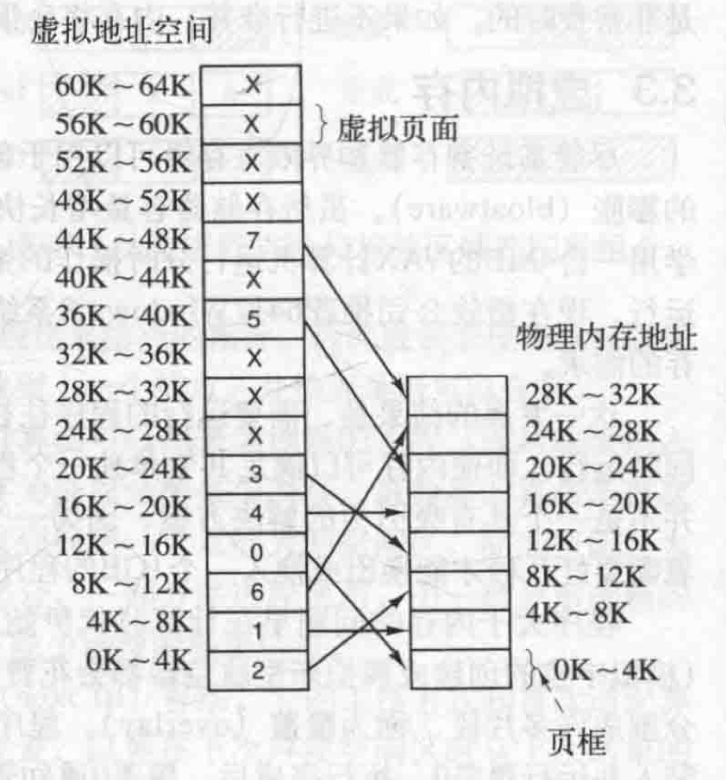
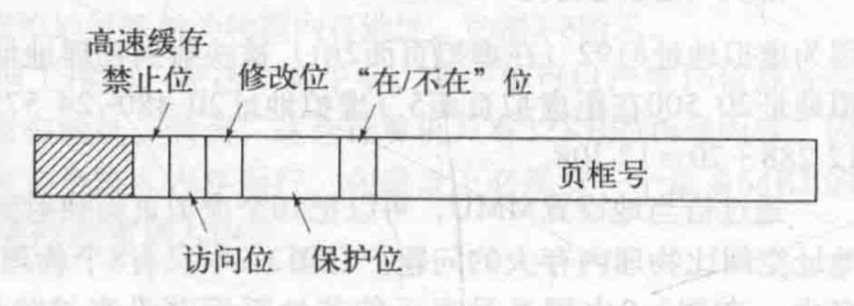

# 概述

尽管基址寄存器和界限寄存器可以用于创建地址空间的抽象，还有另一个问题需要解决：管理软件的膨胀（bloatware）。虽然存储器容量增长快速，但是软件大小的增长更快。在20世纪80年代，许多大学用一台4MB的VAX计算机运行分时操作的系统，供十几个用户（已经或多或少足够满足需要了）同时运行。现在微软公司推荐64位Windows8系统至少需要2GB内存，而多媒体的潮流则进一步推动了对内存的需求

这一发展的结果是，需要运行的程序往往大到内存无法容纳，而且必然需要系统能够支持多个程序同时运行，即使内存可以满足其中单独一个程序的需要，总体来看它们仍然超出了内存大小。交换技术并不是一个具有吸引力的解决方案，因为一个典型SATA磁盘的峰值传输率高达每秒好几百兆，这意味着需要好几秒才能换出或换入一个1GB的程序

程序大于内存的问题早在计算时代伊始就产生了，虽然只是有限的应用领域，像科学和工程计算（模拟宇宙的创建或模拟新型航空器都会花费大量内存）。在20世纪60年代所采取的解决方法是：把程序分割成许多片段，称为**覆盖**（overlay）。程序开始执行时，将覆盖管理模块装入内存，该管理模块立即装人并运行覆盖0。执行完成后，覆盖0通知管理模块装入覆盖1，或者占用覆盖0的上方位置（如果有空间），或者占用覆盖0（如果没有空间）。一些覆盖系统非常复杂，允许多个覆盖块同时在内存中。覆盖块存放在磁盘上，在需要时由操作系统动态地换入换出

虽然由系统完成实际的覆盖块换入换出操作，但是程序员必须把程序分割成多个片段。把一个大程序分割成小的、模块化的片段是非常费时和枯燥的，并且易于出错。很少程序员擅长使用覆盖技术。**因此，没过多久就有人找到一个办法，把全部工作都交给计算机去做**

采用的这个方法（Fotheringham，1961）称为**虚拟内存**（virtual memory）。虚拟内存的基本思想是：**每个程序拥有自己的地址空间，这个空间被分割成多个块，每一块称作一页或页面（page）。每一页有连续的地址范围。这些页被映射到物理内存，但并不是所有的页都必须在内存中才能运行程序。当程序引用到一部分在物理内存中的地址空间时，由硬件立刻执行必要的映射。当程序引用到一部分不在物理内存中的地址空间时，由操作系统负责将缺失的部分装人物理内存并重新执行失败的指令**

从某个角度来讲，虚拟内存是对基址寄存器和界限寄存器的一种综合。8088为正文和数据分离出专门的基址寄存器（但不包括界限寄存器）。而虚拟内存使得整个地址空间可以用相对较小的单元映射到物理内存，而不是为正文段和数据段分别进行重定位。下面会介绍虚拟内存是如何实现的

**虚拟内存很适合在多道程序设计系统中使用，许多程序的片段同时保存在内存中。当一个程序等待它的一部分读入内存时，可以把CPU交给另一个进程使用**

# 分页

由程序产生的地址称为**虚拟地址**（virtual address），它们构成了一个**虚拟地址空间**（virtual addressspace）。在没有虚拟内存的计算机上，系统直接将虚拟地址送到内存总线上，读写操作使用具有同样地址的物理内存字，**而在使用虚拟内存的情况下，虚拟地址不是被直接送到内存总线上，而是被送到内存管理单元（Memory Management Unit，MMU），MMU把虚拟地址映射为物理内存地址**，如下图所示

    

下图所示的例子说明了这种映射是如何工作的。在这个例子中，**有一台可以产生16位地址的计算机，地址范围从0到64K-1，且这些地址是虚拟地址**。**然而，这台计算机只有32KB的物理内存，因此，虽然可以编写64KB的程序，但它们却不能被完全调人内存运行**。在磁盘上必须有一个最多64KB的程序核心映像的完整副本，以保证程序片段在需要时能被调人内存

    

虚拟地址空间按照固定大小划分成被称为**页面**（page）的若干单元。在物理内存中对应的单元称为**页框**（page frame）。页面和页框的大小通常是一样的，在本例中是4KB，但实际系统中的页面大小从 512字节到1GB。对应于64KB的虚拟地址空间和32KB的物理内存，可得到16个虚拟页面和8个页框。RAM和磁盘之间的交换总是以整个页面为单元进行的。很多处理器根据操作系统认为适合的方式，支持对不同大小页面的混合使用和匹配。例如，x86-64架构的处理器支持4KB、2MB和1GB大小的页面，因此，可以将一组4KB大小的页面用于用户程序，将一个1GB大小的页面用于内核程序

如果CPU访问的虚拟地址在物理内存中没有对应的映射，那么CPU将陷入到操作系统，这个陷阱称为**缺页中断**或**缺页错误(page fault)**。操作系统找到一个很少使用的页框且把它的内容写人磁盘（如果它不在磁盘上）。随后把需要访问的页面读到刚才回收的页框中，修改映射关系，然后重新启动引起陷阱的指令

# 页表

作为一种最简单的实现，虚拟地址到物理地址的映射可以概括如下：虚拟地址被分成**虚拟页号**（高位部分）和偏移量（低位部分）两部分。例如，对于16位地址和4KB的页面大小，高4位可以指定16个虚拟页面中的一页，而低12位接着确定了所选页面中的字节偏移量（0~4095）。但是使用3或者5或者其他位数拆分虚拟地址也是可行的。不同的划分对应不同的页面大小

**虚拟页号可用作页表的索引，以找到该虚拟页面对应的页表项。由页表项可以找到页框号（如果有的话）。然后把页框号拼接到偏移量的高位端，以替换掉虚拟页号，形成送往内存的物理地址**

页表的目的是把虚拟页面映射为页框。从数学角度说，页表是一个函数，它的参数是虚拟页号，结果是物理页框号。通过这个函数可以把虚拟地址中的虚拟页面域替换成页框域，从而形成物理地址

    

最重要的域是**页框号**。毕竟页映射的目的是找到这个值，其次是"在/不在"位。这一位是1时表示该表项是有效的，可以使用；如果是0，则表示该表项对应的虚拟页面现在不在内存中，访问该页面会引起一个缺页中断

**保护**（protection）位指出一个页允许什么类型的访问。最简单的形式是这个域只有一位，0表示读/写，1表示只读。一个更先进的方法是使用三位，各位分别对应是否启用读、写、执行该页面

为了记录页面的使用状况，引入了**修改**（modified）位和访问（referenced）位。在写入一页时由硬件自动设置修改位。该位在操作系统重新分配页框时是非常有用的。如果一个页面已经被修改过（即它是"脏"的），则必须把它写回磁盘。如果一个页面没有被修改过（即它是"干净"的），则只简单地把它丢弃就可以了，因为它在磁盘上的副本仍然是有效的。这一位有时也被称为脏位（dirty bit），因为它反映了该页面的状态

不论是读还是写，系统都会在该页面被访问时设置访问位。**它的值被用来帮助操作系统在发生缺页中断时选择要被淘汰的页面**。不再使用的页面要比正在使用的页面更适合淘汰。这一位在很多页面置换算法中都会起到重要的作用

**虚拟内存本质上是用来创造一个新的抽象概念一地址空间，这个概念是对物理内存的抽象，类似于进程是对物理处理器（CPU）的抽象。虚拟内存的实现，是将虚拟地址空间分解成页，并将每一页映射到物理内存的某个页框或者（暂时）解除映射**