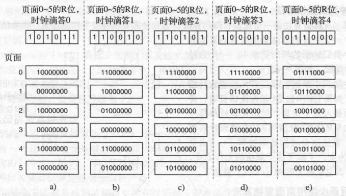
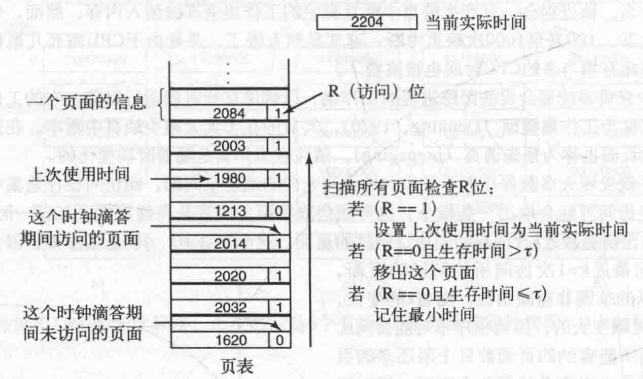
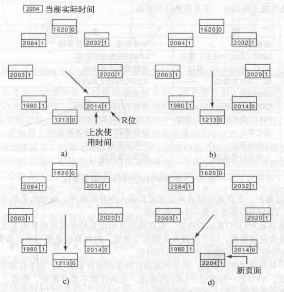
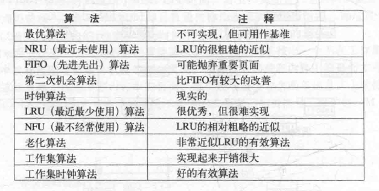

# 目录

   * [最优页面置换算法(无法实现的，实际系统不使用)](#最优页面置换算法无法实现的实际系统不使用)
   * [最近未使用页面置换算法(NRU)](#最近未使用页面置换算法nru)
   * [先进先出页面置换算法](#先进先出页面置换算法)
   * [第二次机会页面置换算法](#第二次机会页面置换算法)
   * [时钟页面置换算法](#时钟页面置换算法)
   * [最近最少使用页面置换算法(LRU)](#最近最少使用页面置换算法lru)
   * [软件模拟LRU(NRU)](#软件模拟lrunru)
   * [工作集页面置换算法](#工作集页面置换算法)
   * [工作集时钟页面置换算法](#工作集时钟页面置换算法)
   * [小结](#小结)

---

当发生缺页中断时，操作系统必须在内存中选择一个页面将其换出内存，以便为即将调入的页面腾出空间。如果要换出的页面在内存驻留期间已经被修改过，就必须把它写回磁盘以更新该页面在磁盘上的副本，如果该页面没有被修改过（如一个包含程序正文的页面），那么它在磁盘上的副本已经是最新的，不需要回写。直接用调入的页面覆盖被淘汰的页面就可以了

当发生缺页中断时，虽然可以随机地选择一个页面来置换，但是如果每次都选择不常使用的页面会提升系统的性能。如果一个被频繁使用的页面被置换出内存，很可能它在很短时间内又要被调入内存这会带来不必要的开销。人们已经从理论和实践两个方面对页面置换算法进行了深入的研究。下面将介绍几个最重要的算法

在接下来讨论的所有页面置换算法中都存在一个问题：当需要从内存中换出某个页面时，它是否只能是缺页进程自己的页面？这个要换出的页面是否可以属于另外一个进程？在前一种情况下，可以有效地将每一个进程限定在固定的页面数目内；后一种情况则不能

# 最优页面置换算法(无法实现的，实际系统不使用)

很容易就可以描述出最好的页面置换算法，虽然此算法不可能实现。该算法是这样工作的：**在缺页中断发生时，有些页面在内存中，其中有一个页面（包含紧接着的下一条指令的那个页面）将很快被访问，其他页面则可能要到10、100或1000条指令后才会被访问，每个页面都可以用在该页面首次被访问前所要执行的指令数作为标记**

**最优页面置换算法规定应该置换标记最大的页面**。如果一个页面在800万条指令内不会被使用，另外一个页面在600万条指令内不会被使用，则置换前一个页面，从而把因需要调入这个页面而发生的缺页中断推迟到将来，越久越好。计算机也像人一样，希望把不愉快的事情尽可能地往后拖延

这个算法唯一的问题就是它是无法实现的。当缺页中断发生时，操作系统无法知道各个页面下一次将在什么时候被访问。（在最短作业优先调度算法中，我们曾遇到同样的情况，即系统如何知道哪个作业是最短的呢？）当然，通过首先在仿真程序上运行程序，跟踪所有页面的访问情况，然后在第二次运行时利用第一次运行时收集的信息是可以实现最优页面置换算法的

用这种方式，可以通过最优页面置换算法对其他可实现算法的性能进行比较。如果操作系统达到的页面置换性能只比最优算法差1%，那么即使花费大量的精力来寻找更好的算法最多也只能换来1%的性能提高

# 最近未使用页面置换算法(NRU)

为使操作系统能够收集有用的统计信息，在大部分具有虚拟内存的计算机中，系统为每一页面设置了两个状态位。当页面被访问（读或写）时设置R位；当页面被写入（即修改）时设置M位。这些位包含在每个页表项中。每次访问内存时更新这些位，因此由硬件来设置它们是必要的。一旦设置某位为1，它就一直保持1直到操作系统将它复位

如果硬件没有这些位，则可以使用操作系统的缺页中断和时钟中断机制进行以下的模拟：**当启动一个进程时，将其所有的页面都标记为不在内存；一旦访问任何一个页面就会引发一次缺页中断，此时操作系统就可以设置R位（在它的内部表中），修改页表项使其指向正确的页面，并设为READ ONLY模式然后重新启动引起缺页中断的指令**，如果随后对该页面的修改又引发一次缺页中断，则操作系统设置这个页面的M位并将其改为READ/WRITE模式

可以用R位和M位来构造一个简单的页面置换算法：当启动一个进程时，它的所有页面的两个位都由操作系统设置成0，R位被定期地（比如在每次时钟中断时）清零，以区别最近没有被访问的页面和被访问的页面

当发生缺页中断时，操作系统检查所有的页面并根据它们当前的R位和M位的值，把它们分为4类：

* 第0类：没有被访问，没有被修改
* 第1类：没有被访问，已被修改
* 第2类：已被访问，没有被修改
* 第3类：已被访问，已被修改

尽管第1类初看起来似乎是不可能的，但是一个第3类的页面在它的R位被时钟中断清零后就成了第1类。时钟中断不清除M位是因为在决定一个页面是否需要写回磁盘时将用到这个信息。清除R位而不清除M位产生了第1类页面

**NRU** （Not Recently Used，最近未使用）算法随机地从类编号最小的非空类中挑选一个页面淘汰。这个算法隐含的意思是，在最近一个时钟滴答中（典型的时间是大约20ms）淘法一个没有被访问的已修改页面要比淘汰一个被频繁使用的"干净"页面好。NRU的主要优点是易于理解和能够有效地被实现，虽然它的性能不是最好的，但是已经够用了

# 先进先出页面置换算法

另一种开销较小的页面置换算法是FIFO(First-In First-Out，先进先出)算法

由操作系统维护一个所有当前在内存中的页面的链表，最新进入的页面放在表尾，最早进入的页面放在表头。当发生缺页中断时，淘汰表头的页面并把新调入的页面加到表尾。FIFO可能会淘汰掉常用的页面，因此，由于这一原因，很少使用纯粹的FIFO算法

# 第二次机会页面置换算法

FIFO算法可能会把经常使用的页面置换出去，为了避免这一问题，对该算法做一个简单的修改：检查最老页面的R位。如果R位是0，那么这个页面既老又没有被使用，可以立刻置换掉，如果是1，就将R位清0，并把该页面放到链表的尾端，修改它的装入时间使它就像刚装人的一样，然后继续搜索

这一算法称为第二次机会（secondchance）算法，第二次机会算法就是寻找一个在最近的时钟间隔内没有被访问过的页面。如果所有的页面都被访问过了，该算法就简化为纯粹的FIFO算法。特别地，想象一下，假设所有页面的R位都被设置了，操作系统将会一个接一个地把每个页面都移动到链表的尾部并清除被移动的页面的R位。最后算法又将回到最开始的第一个页面，此时它的R位已经被清除了，因此该页面将被淘汰，所以这个算法总是可以结束的

# 时钟页面置换算法

尽管第二次机会算法是一个比较合理的算法，但它经常要在链表中移动页面，既降低了效率又不是很有必要。一个更好的办法是把所有的页面都保存在一个类似钟面的环形链表中，一个表针指向最老的页面

当发生缺页中断时，算法首先检查表针指向的页面，如果它的R位是0就淘汰该页面，并把新的页面插人这个位置，然后把表针前移一个位置，如果R位是1就清除R位并把表针前移一个位置。重复这个过程直到找到了一个R位为0的页面为止。了解了这个算法的工作方式，就明白为什么它被称为**时钟**（clock）算法了

# 最近最少使用页面置换算法(LRU)

对最优算法的一个很好的近似是基于这样的观察：在前面几条指令中频繁使用的页面很可能在后面的几条指令中被使用。反过来说，已经很久没有使用的页面很有可能在未来较长的一段时间内仍然不会被使用。这个思想提示了一个可实现的算法：在缺页中断发生时，置换未使用时间最长的页面。这个策略称为**LRU**（**Least Recently Used，最近最少使用**）页面置换算法

虽然LRU在理论上是可以实现的，但代价很高。为了完全实现LRU，需要在内存中维护一个所有页面的链表，最近最多使用的页面在表头，最近最少使用的页面在表尾。困难的是在每次访问内存时都必须要更新整个链表。在链表中找到一个页面，删除它，然后把它移动到表头是一个非常费时的操作，即使使用硬件实现也一样费时（假设有这样的硬件）

然而，还是有一些使用特殊硬件实现LRU的方法。首先考虑一个最简单的方法，这个方法要求硬件有一个64位计数器C，它在每条指令执行完后自动加1，每个页表项必须有一个足够容纳这个计数器值的域。在每次访问内存后，将当前的C值保存到被访问页面的页表项中。一旦发生缺页中断，操作系统就检查所有页表项中计数器的值，找到值最小的一个页面，这个页面就是最近最少使用的页面

# 软件模拟LRU(NRU)

前面一种LRU算法虽然在理论上是可以实现的，但只有非常少的计算机拥有这种硬件。因此，需要一个能用软件实现的解决方案。一种可能的方案称为NFU（Not Frequently Used，最不常用）算法。该算法将每个页面与一个软件计数器相关联，计数器的初值为0。每次时钟中断时，由操作系统扫描内存中所有的页面，将每个页面的R位（它的值是0或1）加到它的计数器上。这个计数器大体上跟踪了各个页面被访问的频繁程度。发生缺页中断时，则置换计数器值最小的页面

NFU的主要问题是它从来不忘记任何事情。比如，在一个多次（扫描）编译器中，在第一次扫描中被频繁使用的页面在程序进人第二次扫描时，其计数器的值可能仍然很高。实际上，如果第一次扫描的执行时间恰好是各次扫描中最长的，含有以后各次扫描代码的页面的计数器可能总是比含有第一次扫描代码的页面的计数器小，结果是操作系统将置换有用的页面而不是不再使用的页面

幸运的是只需对NFU做一个小小的修改就能使它很好地模拟LRU。其修改分为两部分：**首先，在R位被加进之前先将计数器右移一位，其次，将R位加到计数器最左端的位而不是最右端的位**

修改以后的算法称为**老化**（aging）算法，下图解释了它是如何工作的。假设在第一个时钟滴答后，页面0~5的R位值分别是1、0、1、0、1、1（页面0为1，页面1为0，页面2为1，以此类推）。换句话说，在时钟滴答0到时钟滴答1期间，访问了页0、2、4、5，它们的R位设置为1，而其他页面的R位仍然是0。对应的6个计数器在经过移位并把R位插入其左端后的值如下图a所示。图中后面的4列是在下4个时钟滴答后的6个计数器的值

    

发生缺页中断时，将置换计数器值最小的页面。如果一个页面在前面4个时钟滴答中都没有访问过，那么它的计数器最前面应该有4个连续的0，因此它的值肯定要比在前面三个时钟滴答中都没有被访问过的页面的计数器值小

该算法与LRU有两个区别。如上图e中的页面3和页面5,它们都连续两个时钟滴答没有被访问过了，而在两个时钟滴答之前的时钟滴答中它们都被访问过。根据LRU，如果必须置换一个页面,则应该在这两个页面中选择一个。然而现在的问题是，我们不知道在时钟滴答1到时钟滴答2期间它们中的哪一个页面是后被访问到的。因为在每个时钟滴答中只记录了一位，所以无法区分在一个时钟滴答中哪个页面在较早的时间被访问以及哪个页面在较晚的时间被访问，因此，我们所能做的就是置换页面3，原因是页面5在更往前的两个时钟滴答中也被访问过而页面3没有

LRU和老化算法的第二个区别是老化算法的计数器只有有限位数（本例中是8位），这就限制了其对以往页面的记录。如果两个页面的计数器都是0，我们只能在两个页面中随机选一个进行置换。实际上，有可能其中一个页面上次被访问是在9个时钟滴答以前，另一个页面是在1000个时钟滴答以前，而我们却无法看到这些。在实践中，如果时钟滴答是20ms，8位一般是够用的。假如一个页面已经有160ms没有被访问过，那么它很可能并不重要

# 工作集页面置换算法

在单纯的分页系统里，刚启动进程时，在内存中并没有页面。在CPU试图取第一条指令时就会产生一次缺页中断，使操作系统装人含有第一条指令的页面。其他由访问全局数据和堆栈引起的缺页中断通常会紧接着发生。一段时间以后，进程需要的大部分页面都已经在内存了，进程开始在较少缺页中断的情况下运行。这个策略称为**请求调页**（demand paging），因为页面是在需要时被调入的，而不是预先装入

编写一个测试程序很容易，在一个大的地址空间中系统地读所有的页面，将出现大量的缺页中断，因此会导致没有足够的内存来容纳这些页面。不过幸运的是，大部分进程不是这样工作，,它们都表现出了一种**局部性访问行为**，即在进程运行的任何阶段，它都只访问较少的一部分页面。例如，在一个多次扫描编译器中，各次扫描时只访问所有页面中的一小部分，并且是不同的部分

一个进程当前正在使用的页面的集合称为它的**工作集**。如果整个工作集都被装入到了内存中，那么进程在运行到下一运行阶段（例如，编译器的下一遍扫描）之前，不会产生很多缺页中断。若内存太小而无法容纳下整个工作集，那么进程的运行过程中会产生大量的缺页中断，导致运行速度也会变得很缓慢，因为通常只需要几个纳秒就能执行完一条指令，而通常需要十毫秒才能从磁盘上读入一个页面。如果一个程序每10ms只能执行一到两条指令，那么它将会需要很长时间才能运行完。若每执行几条指令程序就发生一次缺页中断，那么就称这个程序发生了**颠簸**

在多道程序设计系统中，经常会把进程转移到磁盘上（即从内存中移走所有的页面），这样可以让其他的进程有机会占有CPU。有一个问题是，当该进程再次调回来以后应该怎样办？从技术的角度上讲，并不需要做什么。该进程会一直产生缺页中断直到它的工作集全部被装入内存。然而，每次装入一个进程时都要产生20、100甚至1000次缺页中断，速度显然太慢了，并且由于CPU需要几毫秒时间处理一个缺页中断，因此有相当多的CPU时间也被浪费了

所以不少分页系统都会设法跟踪进程的工作集，以确保在让进程运行以前，它的工作集就已在内存中了。该方法称为**工作集模型**，其目的在于大大减少缺页中断率。在进程运行前预先装入其工作集页面也称为**预先调页**（prepaging）。请注意工作集是随着时间变化

工作集页面置换算法，基本思路就是找出一个不在工作集中的页面并淘汰它。在下图中可以看到某台机器的部分页表。因为只有那些在内存中的页面才可以作为候选者被淘汰，所以该算法忽略了那些不在内存中的页面。每个表项至少包含两条信息：**上次使用该页面的近似时间和R(访问)位**。空白的矩形表示该算法不需要的其他域，如页框号、保护位、M（修改）位。

    

该算法工作方式如下。如前所述，假定使用硬件来置R位和M位。同样，假定在每个时钟滴答中，有一个定期的时钟中断会用软件方法来清除R位。每当缺页中断发生时，扫描页表以找出一个合适的页面淘汰之

在处理每个表项时，都需要检查R位。如果它是1，就把当前实际时间写进页表项的“上次使用时间”域，以表示缺页中断发生时该页面正在被使用。既然该页面在当前时钟滴答中已经被访问过，那么很明显它应该出现在工作集中，并且不应该被删除(假定tao横跨多个时钟滴答)

如果R是0，那么表示在当前时钟滴答中，该页面还没有被访问过，则它就可以作为候选者被置换。为了知道它是否应该被置换，需要计算它的生存时间（即当前实际运行时间减去上次使用时间），然后与tao做比较。如果它的生存时间大于tao，那么这个页面就不再在工作集中，而用新的页面置换它。扫描会继续进行以更新剩余的表项

然而，如果R是0同时生存时间小于或等于tao，则该页面仍然在工作集中。这样就要把该页面临时保留下来，但是要记录生存时间最长（"上次使用时间"的最小值）的页面。如果扫描完整个页表却没有找到适合被淘汰的页面，也就意味着所有的页面都在工作集中。在这种情况下，如果找到了一个或者多个R=0的页面，就淘汰生存时间最长的页面。在最坏情况下，在当前时间滴答中，所有的页面都被访问过了（也就是都有R=1），因此就随机选择一个页面淘汰，如果有的话最好选一个干净页面

# 工作集时钟页面置换算法

当缺页中断发生后，需要扫描整个页表才能确定被淘汰的页面，因此基本工作集算法是比较费时的。有一种改进的算法，它基于时钟算法，并且使用了工作集信息，称为**WSClock**（工作集时钟）算法（Carr和Hennessey，1981）。由于它实现简单，性能较好，所以在实际工作中得到了广泛应用

与时钟算法一样，所需的数据结构是一个以页框为元素的循环表，见下图a。最初，该表是空的。当装入第一个页面后，把它加到该表中。随着更多的页面的加入，它们形成一个环。每个表项包含来自基本工作集算法的上次使用时间，以及R位（已标明）和M位（未标明）

    

与时钟算法一样，每次缺页中断时，首先检查指针指向的页面。如果R位被置为1，该页面在当前时钟滴答中就被使用过，那么该页面就不适合被淘汰。然后把该页面的R位置为0，指针指向下一个页面，并重复该算法。该事件序列之后的状态见图中的b

现在来考虑指针指向的页面在R=0时会发生什么，见图中的c。如果页面的生存时间大于tao且该页面是干净的，它就不在工作集中，并且在磁盘上有一个有效的副本。申请此页框，并把新页面放在其中，如图中的d所示。另一方面，如果此页面被修改过，就不能立即申请页框，因为这个页面在磁盘上没有有效的副本。为了避免由于调度写磁盘操作引起的进程切换，指针继续向前走，算法继续对下一个页面进行操作。毕竟，有可能存在一个旧的且干净的页面可以立即使用

原则上，所有的页面都有可能因为磁盘I/O在某个时钟周期被调度。为了降低磁盘阻塞，需要设置一个限制，即最大只允许写回n个页面。一旦达到该限制，就不允许调度新的写操作

如果指针经过一圈返回它的起始点会发生什么呢？这里有两种情况：

1. 至少调度了一次写操作
2. 没有调度过写操作

对于第一种情况，指针仅仅是不停地移动，寻找一个干净页面。既然已经调度了一个或者多个写操作，最终会有某个写操作完成，它的页面会被标记为干净。置换遇到的第一个干净页面，这个页面不一定是第一个被调度写操作的页面，因为硬盘驱动程序为了优化性能可能已经把写操作重排序了

对于第二种情况，所有的页面都在工作集中，否则将至少调度了一个写操作。由于缺乏额外的信息，一个简单的方法就是随便置换一个干净的页面来使用，扫描中需要记录干净页面的位置。如果不存在干净页面，就选定当前页面并把它写回磁盘

# 小结

    

总之，最好的两种算法是老化算法和工作集时钟算法，它们分别基于LRU和工作集。它们都具有良好的页面调度性能，可以有效地实现。也存在其他一些算法，但在实际应用中，这两种算法可能是最重要的

