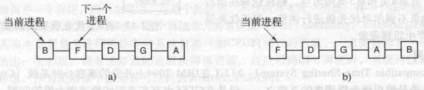
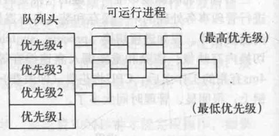

# 目录

   * [简介](#简介)
   * [批处理系统中的调度](#批处理系统中的调度)
      * [先来先服务(first-come first-served)](#先来先服务first-come-first-served)
      * [最短作业优先(shortest job first)](#最短作业优先shortest-job-first)
      * [最短剩余时间优先(shortest remaining time next)](#最短剩余时间优先shortest-remaining-time-next)
   * [交互式系统中的调度](#交互式系统中的调度)
      * [轮转调度(round robin)](#轮转调度round-robin)
      * [优先级调度](#优先级调度)
      * [多级队列](#多级队列)

# 简介

调度，简单来说，就是在多个就绪的进程中，选择一个来使用CPU

调度的时机有：

* 在创建一个新进程之后，需要决定是运行父进程还是运行子进程
* 在一个进程退出时必须做出调度决策，一个进程不再运行，所以必须从就绪进程集中选择另外某个进程
* 当一个进程阻塞在I/O和信号量上或由于其他原因阻塞时，必须选择另一个进程运行
* 在一个I/O中断发生时，必须做出调度决策

根据如何处理时钟中断，可以把调度算法分类两类：

* **非抢占式调度算法**：选一个进程，让它一直运行直至被阻塞(阻塞在I/O上或等待另一个进程)，或者进程自动释放CPU
* **抢占式调度算法：**选一个进程，并且让该进程运行某个固定时段的最大值。如果在该时段结束时，该进程仍在运行，它就被挂起，而调度程序挑选另一个进程运行(如果存在一个就绪进程)。进行抢占式调度处理，需要在时间间隔的末端发生时钟中断，以便把CPU控制返回给调度程序

根据系统环境不同，可以把调度算法的环境分为三类：

* 批处理
* 交互式
* 实时

# 批处理系统中的调度

## 先来先服务(first-come first-served)

这是最简单的非抢占式调度算法，使用该算法，进程按照它们请求CPU的顺序使用CPU。基本上，有一个就绪进程的单一队列。上午，当第一个作业从外部进人系统后，就立即开始并允许运行它所期望的时间长度，该作业不会因为运行太长时间而被中断。当其他作业进入时，它们排到就绪队列尾部。当正在运行的进程被阻塞时，就绪队列中的第一个进程接着运行。当在被阻塞的进程变为就绪时，就像一个新来到的作业一样，排到就绪队列的末尾，即排在所有进程最后

不过，先来先服务也有明显的缺点。假设有一个一次运行1秒钟的计算密集型进程和很少使用CPU但是每个都要进行1000次磁盘读操作才能完成的大量I/O密集型进程存在。计算密集进程运行1秒钟，接着读一个磁盘块。所有的I/O进程开始运行并读磁盘。当该计算密集进程获得其磁盘块时，它运行下一个1秒钟，紧跟随着的是所有I/O进程

这样做的结果是，每个I/O进程在每秒钟内读到一个磁盘块，要花费1000秒钟才能完成操作。如果有一个调度算法每10ms抢占计算密集型进程，那么I/O进程将在10秒钟内完成而不是1000秒钟，而且还不会对计算密集型进程产生多少延迟

## 最短作业优先(shortest job first)

这是一种适用于运行时间可以预知的另一个非抢占式的批处理调度算法，从等待运行的进程中选择执行时间最短的那个来运行

最短任务优先有一些优点，比如简单，并且这种策略减小了所有进程的平均运行时间 (Average Turnaround TIme)。 然而，它的缺点是，如果不断地有新的短期进程不断加入时，他会需要花更长的时间来完成那些长期进程

## 最短剩余时间优先(shortest remaining time next)

最短作业优先的抢占式版本是最短剩余时间优先（shortest remaining time next）算法。使用这个算法，调度程序总是选择剩余运行时间最短的那个进程运行。再次提醒，有关的运行时间必须提前掌握。当一个新的作业到达时，其整个时间同当前进程的剩余时间做比较。如果新的进程比当前运行进程需要更少的时间，当前进程就被挂起，而运行新的进程。这种方式可以使新的短作业获得良好的服务

# 交互式系统中的调度

## 轮转调度(round robin)

一种最古老、最简单、最公平且使用最广的算法是轮转调度（round robin）。每个进程被分配一个时间段，称为时间片（quantum），即允许该进程在该时间段中运行。如果在时间片结束时该进程还在运行，则将剥夺CPU并分配给另一个进程。如果该进程在时间片结束前阻塞或结束，则CPU立即进行切换。时间片轮转调度很容易实现，调度程序所要做的就是维护一张可运行进程列表，如下图a所示。当一个进程用完它的时间片后，就被移到队列的末尾，如下图b所示

    

时间片轮转调度中唯一有趣的一点是时间片的长度。从一个进程切换到另一个进程是需要一定时间进行管理事务处理的一保存和装人寄存器值及内存映像、更新各种表格和列表、清除和重新调入内存高速缓存等。假如**进程切换**（process switch），有时称为**上下文切换**（context switch），需要1ms，包括切换内存映像、清除和重新调入高速缓存等。再假设时间片设为4ms。有了这些参数，则CPU在做完4ms有用的工作之后，CPU将花费（即浪费）1ms来进行进程切换。因此，CPU时间的20%浪费在管理开销上。很明显，管理时间太多了

为了提高CPU的效率，可以将时间片设置成，比方说100ms，这样浪费的时间只有1%。但是，如果在一段非常短的时间间隔内到达50个请求，并且对CPU有不同的需求，那么，考虑一下，在一个服务器系统中会发生什么呢？50个进程会放在可运行进程的列表中。如果CPU是空闲的，第一个进程会立即开始执行，第二个直到100ms以后才会启动，以此类推。假设所有其他进程都用足了它们的时间片的话，最不幸的是最后一个进程在获得运行机会之前将不得不等待5秒钟。大部分用户会认为5秒的响应对于一个短命令来说是缓慢的。如果一些在就绪队列后边的请求仅需要几毫秒的CPU时间，上面的情况会变得尤其糟糕。如果使用较短的时间片的话，它们将会获得更好的服务

另一个因素是，如果时间片设置长于平均的CPU突发时间，那么不会经常发生抢占。相反，在时间片耗费完之前多数进程会完成一个阻塞操作，引起进程的切换。抢占的消失改善了性能，因为进程切换只会发生在确实逻辑上有需要的时候，即进程被阻塞不能够继续运行

可以归结如下结论：时间片设得太短会导致过多的进程切换，降低了CPU效率，而设得太长又可能引起对短的交互请求的响应时间变长。将时间片设为20~50ms通常是一个比较合理的折中

## 优先级调度

轮转调度做了一个隐含的假设,即所有的进程同等重要,而拥有和操作多用户计算机系统的人对此常有不同的看法。例如，在一所大学里，等级顺序可能是教务长首先，然后是教授、秘书、后勤人员，最后是学生。这种将外部因素考虑在内的需要就导致了优先级调度。其基本思想很清楚：每个进程被赋予一个优先级，允许优先级最高的可运行进程先运行

即使在只有一个用户的PC上，也会有多个进程，其中一些比另一些更重要。例如，与在屏幕上实时显示视频电影的进程相比，在后台发送电子邮件的守护进程应该被赋予较低的优先级

为了防止高优先级进程无休止地运行下去，调度程序可能在每个时钟滴答（即每个时钟中断）降低当前进程的优先级。如果这一行为导致该进程的优先级低于次高优先级的进程，则进行进程切换。另一种方法是给每个进程赋予一个允许运行的最大时间片，当用完这个时间片时，次高优先级的进程便获得运行机会

可以很方便地将一组进程按优先级分成若干类，**并且在各类之间采用优先级调度，而在各类进程的内部采用轮转调度**。下图给出了一个有4类优先级的系统，其调度算法如下：**只要存在优先级为第4类的可运行进程就按照轮转法为每个进程运行一个时间片，此时不理会较低优先级的进程。若第4类进程为空，则按照轮转法运行第3类进程。若第4类和第3类均为空，则按轮转法运行第2类进程。如果不偶尔对优先级进行调整，则低优先级进程很可能会产生饥饿现象**

    

## 多级队列

**属于最高优先级类的进程运行一个时间片，属于次高优先级类的进程运行2个时间片，再次一级运行4个时间片，以此类推。当一个进程用完分配的时间片后，它被移到下一类**

作为一个例子，考虑有一个进程需要连续计算100个时间片。它最初被分配1个时间片，然后被换出。下次它将获得2个时间片，接下来分别是4、8、16、32和64。当然最后一次它只使用64个时间片中的37个便可以结束工作。该进程需要7次交换（包括最初的装入），而如果采用纯粹的轮转算法则需要100次交换。而且，随着进程优先级的不断降低，它的运行频度逐渐放慢，从而为短的交互进程让出CPU

