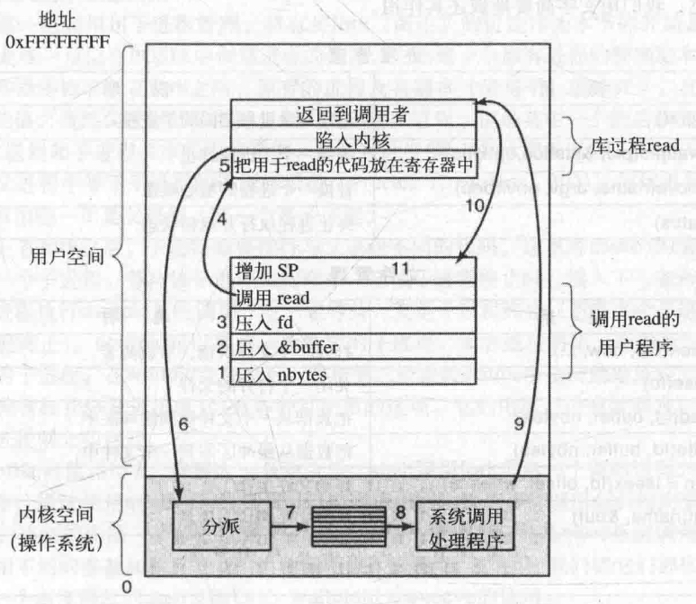
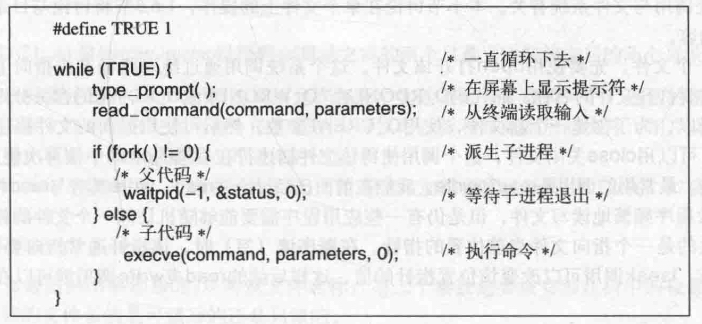
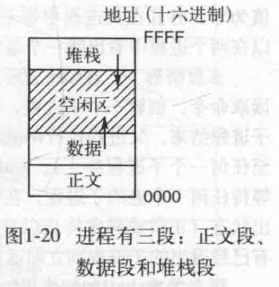

# 目录

   * [系统调用](#系统调用)
   * [用于进程管理的系统调用](#用于进程管理的系统调用)
   * [用于文件管理的系统调用](#用于文件管理的系统调用)
   * [用于目录管理的系统调用](#用于目录管理的系统调用)

# 系统调用

我们已经看到操作系统具有两种功能：为用户程序提供抽象和管理计算机资源。在多数情形下，用户程序和操作系统之间的交互处理的是前者，例如，创建、写入、读出和删除文件。对用户而言，资源管理部分主要是透明和自动完成的。这样，用户程序和操作系统之间的交互主要就是处理抽象。为了真正理解操作系统的行为，我们必须仔细地分析这个接口

如UNIX提供一个有三个参数的read系统调用：一个参数指定文件，一个说明数据应存放的位置，另一个说明应读出多少字节

**由于引发系统调用的实际机制是非常依赖于机器的，而且必须用汇编代码表达，所以，通过提供过程库使C程序中能够使用系统调用，当然也包括其他语言**

**任何单CPU计算机一次只能执行一条指令。如果一个进程正在用户态运行一个用户程序，并且需要一个系统服务，比如从一个文件读数据，那么它就必须执行一个陷阱或系统调用指令，将控制转移到操作系统。操作系统接着通过参数检查找出所需要的调用进程。然后，它执行系统调用，并把控制返回给在系统调用后面跟随着的指令。在某种意义上，进行系统调用就像进行一个特殊的过程调用，但是只有系统调用可以进入内核，而过程调用则不能**

下面考察read系统调用，几乎与所有的系统调用一样，它的调用由C程序完成，方法是调用一个与该系统调用名称相同的库过程：**read**，形式如下：

`count = read(fd, buffer, nbytes);`

系统调用（以及库过程）在count中返回实际读出的字节数。这个值通常和nbytes相同，但也可能更小，例如，如果在读过程中遇到了文件尾的情形就是如此。如果系统调用不能执行，不论是因为无效的参数还是磁盘错误，count都会被置为-1，而在全局变量errno中放入错误号。程序应该经常检查系统调用的结果，以了解是否出错

系统调用时通过一系列的步骤实现的，下图为read系统调用的11个步骤

    

由于历史的原因，C以及C++编译器使用逆序（必须把第一个参数赋给printf（格式字符串），放在堆栈的顶部）。第一个和第三个参数是值调用，但是第二个参数通过引用传递，即传递的是缓冲区的地址（由&指示），而不是缓冲区的内容。接着是对库过程的实际调用（第4步）。这个指令是用来调用所有过程的正常过程调用指令

在可能是由汇编语言写成的库过程中，一般把系统调用的编号放在操作系统所期望的地方，如寄存器中（第5步）。然后执行一个TRAP指令，将用户态切换到内核态，并在内核中的一个固定地址开始执行（第6步）。**TRAP指令实际上与过程调用指令非常类似，它们后面都跟随一个来自远处位置的指令以及供以后使用的一个保存在栈中的返回地址**

然而，TRAP指令与过程指令存在两个方面的差别。首先，它的副作用是，切换到内核态。而过程调用指令并不改变模式。其次，不像给定过程所在的相对或绝对地址那样，TRAP指令不能跳转到任意地址上。根据机器的体系结构，或者跳转到一个单固定地址上，或者指令中有一8位长的字段，它给定了内存中一张表格的索引，这张表格中含有跳转地址

跟随在TRAP指令后的内核代码开始检查系统调用编号，然后分派给正确的系统调用处理器，这通常是通过一张由系统调用编号所引用的、指向系统调用处理器的指针表来完成（第7步）。此时，系统调用处理器运行（第8步）。一旦系统调用处理器完成其工作，控制可能会在跟随TRAP指令后面的指令中返回给用户空间库过程（第9步）。这个过程接着以通常的过程调用返回的方式，返回到用户程序（第10步）

为了完成整个工作，用户程序还必须清除堆栈，如同它在进行任何过程调用之后一样（第11步）。假设堆栈向下增长，如经常所做的那样，编译后的代码准确地增加堆栈指针值，以便清除调用read之前压入的参数。在这之后，原来的程序就可以随意执行了

在前面第9步中，我们提到"控制可能会在跟随TRAP指令后面的指令中返回给用户空间库过程"，这是有原因的。系统调用可能堵塞调用者，避免它继续执行。例如，如果试图读键盘，但是并没有任何键入，那么调用者就必须被阻塞。在这种情形下，操作系统会查看是否有其他可以运行的进程。稍后，当需要的输入出现时，进程会提醒系统注意，然后步骤9~步骤11会接着进行

---

下面是一些POSXI系统调用中比较重要的过程调用，分为4类

进程管理

| 调用                                  | 说明                               |
| ------------------------------------- | ---------------------------------- |
| pid = fork()                          | 创建与父进程相同的子进程           |
| pid = waitpid(pid, &statloc, options) | 等待一个子进程终止                 |
| s = execve(name, argv, environp)      | 替换一个进程的核心映像（地址空间） |
| exit(status)                          | 终止进程执行并返回状态             |

文件管理

| 调用                                 | 说明                         |
| ------------------------------------ | ---------------------------- |
| fd = open(file, how, ...)            | 打开一个文件供读、写或两者   |
| s = close(fd)                        | 关闭一个打开的文件           |
| n = read(fd, buffer, nbytes)         | 把数据从一个文件读到缓冲区中 |
| n = write(fd, buffer, nbytes)        | 把数据从缓冲区写到一个文件中 |
| position = lseek(fd, offset, whence) | 移动文件指针                 |
| s = stat(name, &buf)                 | 取得文件的状态信息           |

目录和文件系统管理

| 调用                           | 说明                               |
| ------------------------------ | ---------------------------------- |
| s = mkdir(name, mode)          | 创建一个新目录                     |
| s = rmdir(name)                | 删除一个目录                       |
| s = link(name1, name2)         | 创建一个新目录项name2，并指向name1 |
| s = unlink(name)               | 删去一个目录项                     |
| s = mount(special, name, flag) | 安装一个文件系统                   |
| s = umnout(special)            | 卸载一个文件系统                   |

杂项

| 调用                     | 说明                       |
| ------------------------ | -------------------------- |
| s = chdir(dirname)       | 改变工作目录               |
| s = chmod(name, mode)    | 修改一个文件的保护位       |
| s = kill(pid, signal)    | 发送信号给一个进程         |
| seconds = time(&seconds) | 自1970年1月1日起的流逝时间 |

有必要指出，将POSIX过程映射到系统调用并不是一对一的。POSIX标准定义了构造系统所必须提供的一套过程，但是并没有规定它们是系统调用、库调用还是其他的形式。如果不通过系统调用就可以执行一个过程（即无须陷人内核），那么从性能方面考虑，它通常会在用户空间中完成。不过，多数POSIX过程确实进行系统调用，通常是一个过程直接映射到一个系统调用上。在一些情形下，特别是所需要的过程仅仅是某个调用的变体时，一个系统调用会对应若干个库调用

# 用于进程管理的系统调用

在UNIX中，fork是唯一可以在POSIX中创建进程的途径。它创建一个原有进程的精确副本，包括所有的文件描述符、寄存器等内容。在fork之后，原有的进程及其副本（父与子）就分开了。在fork时，所有的变量具有一样的值，虽然父进程的数据被复制用以创建子进程，但是其中一个的后续变化并不会影响到另一个。（由父进程和子进程共享的程序正文，是不可改变的。）fork调用返回一个值，在子进程中该值为零，并且在父进程中等于子进程的进程标识符（Process IDentifier，PID）。使用返回的PID，就可以在两个进程中看出哪一个是父进程，哪一个是子进程

多数情形下，在fork之后，子进程需要执行与父进程不同的代码。这里考虑shell的情形。它从终端读取命令，创建一个子进程，等待该子进程执行命令，在该子进程终止时，读入下一条命令。为了等待子进程结束，父进程执行waitpid系统调用，它只是等待，直至子进程终止（若有多个子进程的话，则直至任何一个子进程终止）。waitpid可以等待一个特定的子进程，或者通过将第一个参数设为-1的方式，等待任何一个老的子进程。在waitpid完成之后，将把第二个参数statloc所指向的地址设置为子进程的退出状态（正常或异常终止以及退出值）。有各种可使用的选项，它们由第三个参数确定。例如，如果没有已经退出的子进程则立即返回

现在考虑shell如何使用fork。在键入一条命令后，shel调用fork创建一个新的进程。这个子进程必须执行用户的命令。通过使用execve系统调用可以实现这一点，这个系统调用会引起其整个核心映像被一个文件所替代，该文件由第一个参数给定。（实际上，该系统调用自身是exec系统调用，但是若干个不同的库过程使用不同的参数和稍有差别的名称调用该系统调用。在这里，我们把它们都视为系统调用。）在下图中，用一个高度简化的shell说明fork、waitpid以及execve的使用

    

在UNIX中的进程将其存储空间划分为三段：**正文段**（如程序代码）、**数据段**（如变量）以及**堆栈段**。**数据向上增长而堆栈向下增长**，**夹在中间的是未使用的地址空间**。堆栈在需要时自动地向中间增长，不过数据段的扩展是显式地通过系统调用brk进行的，在数据段扩充后，该系统调用指定一个新地址。但是，这个调用不是POSIX标准
中定义的，对于存储器的动态分配，鼓励程序员使用malloc库过程，而malloc的内部实现则不是一个适合标准化的主题，因为几乎没有程序员直接使用它

    

# 用于文件管理的系统调用

要读写一个文件，先要使用open打开该文件。这个系统调用通过绝对路径名或指向工作目录的相对路径名指定要打开文件的名称，而代码O_RDONLY、O_WRONLY或O_RDWR的含义分别是只读、只写或两者都可以。为了创建一个新文件，使用O_CREAT参数。然后可使用返回的文件描述符进行读写操作。接着，可以用close关闭文件，这个调用使得该文件描述符在后续的open中被再次使用

毫无疑问，最常用的调用是read和write。我们在前面已经讨论过read。write具有与read相同的参数

尽管多数程序频繁地读写文件，但是仍有一些应用程序需要能够随机访问一个文件的任意部分。与每个文件相关的是一个指向文件当前位置的指针。在顺序读（写）时，该指针通常指向要读出（写人）的下一个字节。Iseek调用可以改变该位置指针的值，这样后续的read或write调用就可以在文件的任何地方开始

lseek有三个参数：第一个是文件的描述符，第二个是文件位置，第三个说明该文件位置是相对于文件起始位置、当前位置还是文件的结尾。在修改了指针之后，Iseek所返回的值是文件中的绝对位置

UNIX为每个文件保存了该文件的类型（普通文件、特殊文件、目录等）、大小、最后修改时间以及其他信息。程序可以通过stat系统调用查看这些信息。第一个参数指定了要被检查的文件，第二个参数是一个指针，该指针指向存放这些信息的结构。对于一个打开的文件而言，fstat调用完成同样的工作

# 用于目录管理的系统调用

mkdir和rmdir和分别用于创建和删除目录。下一个调用是lik。它的作用是允许同一个文件以两个或多个名称出现，多数情形下是在不同的目录中这样做。它的典型应用是,在同一个开发团队中允许若干个成员共享一个共同的文件，他们每个人都在自己的目录中有该文件，但可能采用的是不同的名称。共享一个文件，与每个团队成员都有一个私用副本并不是同一件事，因为共享文件意味着任何成员所做的修改都立即为其他成员所见一只有一个文件存在。而在复制了一个文件的多个副本之后，对其中一个副本所进行的修改并不会影响到其他的副本
