# 目录
   * [进程](#进程)
      * [进程模型](#进程模型)
      * [进程的创建](#进程的创建)
      * [进程的终止](#进程的终止)
      * [进程的层次结构](#进程的层次结构)
      * [进程的状态](#进程的状态)
      * [进程的实现](#进程的实现)
   * [线程](#线程)
      * [线程的使用](#线程的使用)
      * [经典的线程模型](#经典的线程模型)
      * [POSIX线程](#posix线程)
      * [在用户空间中实现线程](#在用户空间中实现线程)
      * [在内核中实现线程](#在内核中实现线程)
      * [混合实现](#混合实现)
      * [调度程序激活机制(？)](#调度程序激活机制)
   * [进程间通信](#进程间通信)
      * [竞争条件](#竞争条件)
      * [临界区](#临界区)
      * [忙等待的互斥](#忙等待的互斥)
         * [屏蔽中断](#屏蔽中断)
         * [锁变量](#锁变量)
         * [严格轮换法](#严格轮换法)
         * [Peterson解法](#peterson解法)
         * [TSL指令](#tsl指令)
      * [睡眠与唤醒](#睡眠与唤醒)
      * [信号量](#信号量)
      * [互斥量](#互斥量)
         * [pthread中的互斥量](#pthread中的互斥量)
# 进程

一般用户不知道，当启动系统时，会秘密启动许多进程。例如，启动一个进程用来等待进入的电子邮件；或者启动另一个防病毒进程周期性地检查是否有病毒库更新。另外，某个用户进程可能会在所有用户上网的时候打印文件以及刻录CD-ROM。这些活动都需要管理，于是一个**支持多进程的多道程序系统**在这里就显得很有用了

**在任何多道程序设计系统中，CPU由一个进程快速切换至另一个进程，使每个进程各运行几十或几**
**百毫秒**。严格地说，在某一个瞬间，CPU只能运行一个进程。但在1秒钟内，它可能运行多个进程，这
样就产生并行的错觉。有时人们所说的**伪并行**就是指这种情形，以此来区分**多处理器系统(该系统有两**
**个或多个CPU共享同一个物理内存)的真正硬件并行**。人们很难对多个并行活动进行跟踪，因此，经过多年的努力，操作系统的设计者开发了用于描述并行的一种概念模型（顺序进程），使得并行更容易处理

## 进程模型

在进程模型中，计算机上所有可运行的软件，通常也包括操作系统，被组织成若干顺序进程 （sequential process），简称进程（process）。一个进程就是一个正在执行程序的实例，包括**程序计数器、寄存器和变量的当前值**。从概念上说，每个进程拥有它自己的虚拟CPU。当然，实际上真正的CPU在各进程之间来回切换。但为了理解这种系统，考虑在（伪）并行情况下运行的进程集，要比试图跟踪CPU如何在程序间来回切换简单得多。这种快速的切换称作**多道程序设计**

在下图a中可以看到，在一台多道程序计算机的内存中有4道程序。在图b中，这4道程序被抽象为4个各自拥有自己控制流程（即每个程序自己的逻辑程序计数器）的进程，并且每个程序都独立地运行。当然，实际上只有一个物理程序计数器，所以在每个程序运行时，它的逻辑程序计数器被装人实际的程序计数器中。当该程序执行结束（或暂停执行）时，物理程序计数器被保存在内存中该进程的逻辑程序计数器中。在图c中可以看到，在观察足够长的一段时间后，所有的进程都运行了，**但在任何一个给定的瞬间仅有一个进程真正在运行**

    
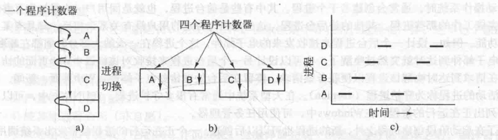

我们假设只有一个CPU。当然，逐渐这个假设就不为真了，因为新的芯片经常是多核的，包含2个、4个或更多的CPU。现在一次只考虑一个CPU会更简单一些。因此，当我们说一个CPU只能真正一次运行一个进程的时候，即使有2个核（或CPU），每一个核也只能一次运行一个进程

---

进程和程序间的区别是很微妙的，但非常重要。用一个比喻可以更容易理解这一点。想象一位有一手好厨艺的计算机科学家正在为他的女儿烘制生日蛋糕。他有做生日蛋糕的食谱，厨房里有所需的原料：面粉、鸡蛋、糖、香草汁等。在这个比喻中，做蛋糕的食谱就是程序（即用适当形式描述的算法），计算机科学家就是处理器（CPU），而做蛋糕的各种原料就是输人数据。进程就是厨师阅读食谱、取来各种原料以及烘制蛋糕等一系列动作的总和

现在假设计算机科学家的儿子哭着跑了进来，说他的头被一只蜜蜂蛰了。计算机科学家就记录下他照着食谱做到哪儿了（保存进程的当前状态），然后拿出一本急救手册，按照其中的指示处理蛰伤。这里，处理机从一个进程（做蛋糕）切换到另一个高优先级的进程（实施医疗救治），每个进程拥有各自的程序（食谱和急救手册）。当蜜蜂蛰伤处理完之后，这位计算机科学家又回来做蛋糕，从他离开时的那一步继续做下去

这里的关键思想是：一个进程是某种类型的一个活动，它有程序、输入、输出以及状态。**单个处理器可以被若干进程共享，它使用某种调度算法决定何时停止一个进程的工作，并转而为另一个进程提供服务**

值得注意的是，如果一个程序运行了两遍，则算作两个进程。例如，人们可能经常两次启动同一个字处理软件，或在有两个可用的打印机的情况下同时打印两个文件。像"两个进程恰好运行同一个程序"这样的事实其实无关紧要，因为它们是不同的进程。操作系统能够使它们共享代码，因此只有一个副本放在内存中，但那只是一个技术性的细节，不会改变有两个进程正在运行的概念

## 进程的创建

4种主要事件会导致进程的创建：

* 系统初始化
* 正在运行的程序执行了创建进程的系统调用
* 用户请求创建一个新进程
* 一个批处理作业的初始化

启动操作系统时，通常会创建若千个进程。其中有些是前台进程，也就是同用户（人类）交互并且替他们完成工作的那些进程。其他的是后台进程，这些进程与特定的用户没有关系，相反，却具有某些专门的功能。例如，设计一个后台进程来接收发来的电子邮件，这个进程在一天的大部分时间都在睡眠，但是当电子邮件到达时就突然被唤醒了。也可以设计另一个后台进程来接收对该机器中Web页面的访问请求，在请求到达时唤醒该进程以便服务该请求。停留在后台处理诸如电子邮件、Web页面、新闻、打印之类活动的进程称为**守护进程**（daemon）。在大型系统中通常有很多守护进程

除了在启动阶段创建进程之外，新的进程也可以以后创建。一个正在运行的进程经常发出系统调用，以便创建一个或多个新进程协助其工作。在所要从事的工作可以容易地划分成若干相关的但没有相互作用的进程时，创建新的进程就特别有效果。例如，如果有大量的数据要通过网络调取并进行顺序处理，那么创建一个进程取数据，并把数据放入共享缓冲区中，而让第二个进程取走数据项并处理之，应该比较容易。在多处理机中，让每个进程在不同的CPU上运行会使整个作业运行得更快

在交互式系统中，键人一个命令或者点（双）击一个图标就可以启动一个程序。这两个动作中的任何一个都会开始一个新的进程，并在其中运行所选择的程序。在基于命令行的UNIX系统中运行程序X，新的进程会从该进程接管开启它的窗口。在Microsoft Windows中，多数情形都是这样的，在一个进程开始时，它并没有窗口，但是它可以创建一个（或多个）窗口。在UNIX和Windows系统中，用户可以同时打开多个窗口，每个窗口都运行一个进程。通过鼠标用户可以选择一个窗口并且与该进程交互，例如，在需要时提供输人

最后一种创建进程的情形仅在大型机的批处理系统中应用。用户在这种系统中（可能是远程地）提交批处理作业。在操作系统认为有资源可运行另一个作业时，它创建一个新的进程，并运行其输人队列中的下一个作业

在UNIX系统中，只有一个系统调用可以用来创建新进程：**fork**。这个系统调用会创建一个与调用进程相同的副本。在调用了fork后，这两个进程（父进程和子进程）拥有相同的内存映像、同样的环境字符串和同样的打开文件。这就是全部情形。通常，子进程接着执行**execve**或一个类似的系统调用，以修改其内存映像并运行一个新的程序。例如，当一个用户在shell中键入命令sort时，shell就创建一个子进程，然后，这个子进程执行sort。之所以要安排两步建立进程，是为了在fork之后但在execve之前允许该子进程处理其文件描述符，这样可以完成对标准输入文件、标准输出文件和标准错误文件的重定向

在UNIX和Windows中，进程创建之后，父进程和子进程有各自不同的地址空间。如果其中某个进程在其地址空间中修改了一个字，这个修改对其他进程而言是不可见的。在UNIX中，子进程的初始地址空间是父进程的一个副本，但是这里涉及两个不同的地址空间，不可写的内存区是共享的。某些UNIX的实现使程序正文在两者间共享，因为它不能被修改。或者，子进程共享父进程的所有内存，但这种情况下内存通过**写时复制**（copy-on-write）共享，这意味着一旦两者之一想要修改部分内存，则这块内存首先被明确地复制，以确保修改发生在私有内存区域。再次强调，可写的内存是不可以共享的。但是，对于一个新创建的进程而言，确实有可能共享其创建者的其他资源，诸如打开的文件等。在Windows中，从一开始父进程的地址空间和子进程的地址空间就是不同的

## 进程的终止

进程的终止通常由下列条件引起：

* 正常退出（自愿的）
* 出错退出（自愿的）
* 严重错误（非自愿）
* 被其他进程杀死（非自愿）

多数进程是由于完成了它们的工作而终止。当编译器完成了所给定程序的编译之后，编译器执行一个系统调用，通知操作系统它的工作已经完成。在UNIX中该调用是exit，而在Windows中，相关的调用是ExitProcess。面向屏幕的程序也支持自愿终止。字处理软件、Internet浏览器和类似的程序中总有一个供用户点击的图标或菜单项，用来通知进程删除它所打开的任何临时文件，然后终止

进程终止的第二个原因是进程发现了严重错误。例如，如果用户键入命令 cc foo.c
要编译程序foo.c，但是该文件并不存在，于是编译器就会退出。在给出了错误参数时，面向屏幕的交互式进程通常并不退出。相反，这些程序会弹出一个对话框，并要求用户再试一次

进程终止的第三个原因是由进程引起的错误，通常是由于程序中的错误所致。例如，执行了一条非法指令、引用不存在的内存，或除数是零等。有些系统中（如UNIX），进程可以通知操作系统，它希望自行处理某些类型的错误，在这类错误中，进程会收到信号（被中断），而不是在这类错误出现时终止

第四种终止进程的原因是，某个进程执行一个系统调用通知操作系统杀死某个其他进程。在UNIX中，这个系统调用是kill。在Win32中对应的函数是TerminateProcess。在这两种情形中，"杀手"都必须获得确定的授权以便进行动作。在有些系统中，当一个进程终止时，不论是自愿的还是其他原因，由该进程所创建的所有进程也一律立即被杀死。不过，UNIX和Windows都不是这种工作方式

## 进程的层次结构

某些系统中，当进程创建了另一个进程后，父进程和子进程就以某种形式继续保持关联。子进程自身可以创建更多的进程，组成一个进程的层次结构。请注意，这与植物和动物的有性繁殖不同，进程只有一个父进程（但是可以有零个、一个、两个或多个子进程）

在UNIX中，进程和它的所有子进程以及后裔共同组成一个进程组。当用户从键盘发出一个信号时，该信号被送给当前与键盘相关的进程组中的所有成员（它们通常是在当前窗口创建的所有活动进程）。每个进程可以分别捕获该信号、忽略该信号或采取默认的动作，即被该信号杀死

这里有另一个例子，可以用来说明进程层次的作用，考虑UNIX在启动时如何初始化自己。一个称为init的特殊进程出现在启动映像中。当它开始运行时，读人一个说明终端数量的文件。接着，为每个终端创建一个新进程。这些进程等待用户登录。如果有一个用户登录成功，该登录进程就执行一个shell准备接收命令。所接收的这些命令会启动更多的进程，以此类推。这样，在整个系统中，所有的进程都属于以init为根的一棵树

相反，Windows中没有进程层次的概念，所有的进程都是地位相同的。唯一类似于进程层次的暗示是在创建进程的时候，父进程得到一个特别的令牌（称为句柄），该句柄可以用来控制子进程。但是，它有权把这个令牌传送给某个其他进程，这样就不存在进程层次了。在UNIX中，进程就不能剥夺其子继承的"继承权"

## 进程的状态

当一个进程在逻辑上不能继续运行时，它就会被阻塞，典型的例子是它在等待可以使用的输入。还可能有这样的情况：一个概念上能够运行的进程被迫停止，因为操作系统调度另一个进程占用了CPU。这两种情况是完全不同的。在第一种情况下，进程挂起是程序自身固有的原因（在键入用户命令行之前，无法执行命令）。第二种情况则是由系统技术上的原因引起的（由于没有足够的CPU，所以不能使每个进程都有一台私用的处理器）。在下图中可以看到显示进程的三种状态的状态图，这三种状态是：

* 运行态（该时刻进程实际占用CPU）
* 就绪态（可运行，但因为其他进程正在运行而暂时停止）
* 阻塞态（除非某种外部事件发生，否则进程不能运行）

    
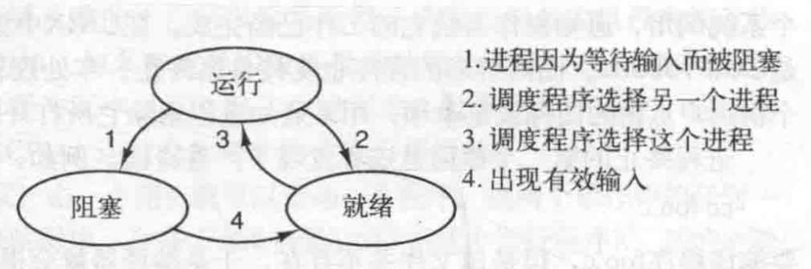

前两种状态在逻辑上是类似的。处于这两种状态的进程都可以运行，只是对于第二种状态暂时没有CPU分配给它。第三种状态与前两种状态不同，处于该状态的进程不能运行，即使CPU空闲也不行

进程的三种状态之间有四种可能的转换关系，如上图所示。在操作系统发现进程不能继续运行下去时，发生转换1。在某些系统中，进程可以执行一个诸如pause的系统调用来进入阻塞状态。在其他系统中，包括UNIX，当一个进程从管道或设备文件（例如终端）读取数据时，如果没有有效的输入存在，则进程会被自动阻塞

转换2和3是由进程调度程序引起的，进程调度程序是操作系统的一部分，进程甚至感觉不到调度程序的存在。系统认为一个运行进程占用处理器的时间已经过长，决定让其他进程使用CPU时间时，会发生转换2。在系统已经让所有其他进程享有了它们应有的公平待遇而重新轮到第一个进程再次占用CPU运行时，会发生转换3。调度程序的主要工作就是决定应当运行哪个进程、何时运行及它应该运行多长时间，这是很重要的一点。目前已经提出了许多算法，这些算法力图在整体效率和进程的竞争公平性之间取得平衡

当进程等待的一个外部事件发生时（如一些输入到达），则发生转换4。如果此时没有其他进程运行，则立即触发转换3，该进程便开始运行。否则该进程将处于就绪态，等待CPU空闲并且轮到它运行

## 进程的实现

为了实现进程模型，操作系统维护着一张表格（一个结构数组），即**进程表**（process table）。每个进程占用一个进程表项。（有些作者称这些表项为**进程控制块**。）该表项包含了进程状态的重要信息，**包括程序计数器、堆栈指针、内存分配状况、所打开文件的状态、账号和调度信息**，以及其他在进程由运行态转换到就绪态或阻塞态时必须保存的信息，从而保证该进程随后能再次启动，就像从未被中断过一样

下图展示了在一个典型系统中进程表项的关键字段

    

在了解进程表后，就可以对在单个（或每一个）CPU上如何维持多个顺序进程的错觉做更多的阐述。与每一I/O类关联的是一个称作**中断向量**（interruptvector）的位置（靠近内存底部的固定区域）。它包含中断服务程序的入口地址。假设当一个磁盘中断发生时，用户进程3正在运行，则中断硬件将程序计数器、程序状态字、有时还有一个或多个寄存器压人堆栈，计算机随即跳转到中断向量所指示的地址。这些是硬件完成的所有操作，然后软件，特别是中断服务例程就接管一切剩余的工作

所有的中断都从保存寄存器开始，对于当前进程而言，通常是保存在进程表项中。随后，会从堆栈中删除由中断硬件机制存人堆栈的那部分信息，并将堆栈指针指向一个由进程处理程序所使用的临时堆栈。一些诸如保存寄存器值和设置堆栈指针等操作，无法用C语言这一类高级语言描述，所以这些操作通过一个短小的汇编语言例程来完成，通常该例程可以供所有的中断使用，因为无论中断是怎样引起的，有关保存寄存器的工作则是完全一样的

当该例程结束后，它调用一个C过程处理某个特定的中断类型剩下的工作。（假定操作系统由C语言编写，通常这是所有真实操作系统的选择）。在完成有关工作之后，大概就会使某些进程就绪，接着调用调度程序，决定随后该运行哪个进程。随后将控制转给一段汇编语言代码，为当前的进程装入寄存器值以及内存映射并启动该进程运行。下图总结了中断处理和调度的过程。注意，各种系统之间的某些细节会有所不同

    

# 线程

在传统操作系统中，每个进程有一个地址空间和一个控制线程。事实上，这几乎就是进程的定义。不过，经常存在在同一个地址空间中准并行运行多个控制线程的情形，这些线程就像（差不多）分离的进程（共享地址空间除外）

## 线程的使用

为什么人们需要在一个进程中再有一类进程？有若干理由说明产生这些迷你进程（称为**线程**）的必要性。下面我们来讨论其中一些理由。**人们需要多线程的主要原因是，在许多应用中同时发生着多种活动。其中某些活动随着时间的推移会被阻塞。通过将这些应用程序分解成可以并行运行的多个顺序线程，程序设计模型会变得更简单**

前面已经进行了有关讨论。准确地说，这正是之前关于进程模型的讨论。有了这样的抽象，我们才**不必考虑中断、定时器和上下文切换，而只需考察并行进程**。**类似地，只是在有了多线程概念之后，我们才加入了一种新的元素：并行实体拥有共享同一个地址空间和所有可用数据的能力**。**对于某些应用而言，这种能力是必需的，而这正是多进程模型（它们具有不同的地址空间）所无法表达的**

第二个关于需要多线程的理由是，**由于线程比进程更轻量级，所以它们比进程更容易（即更快）创建，也更容易撤销。在许多系统中，创建一个线程较创建一个进程要快10~100倍。在有大量线程需要动态和快速修改时，具有这一特性是很有用的**

需要多线程的第三个原因涉及性能方面的讨论。若多个线程都是CPU密集型的，那么并不能获得性能上的增强，但是如果存在着大量的计算和大量的I/O处理，拥有多个线程允许这些活动彼此重叠进行，从而会加快应用程序执行的速度

## 经典的线程模型

既然已经清楚为什么线程会有用以及如何使用它们，不如让我们用更进一步的眼光来审查一下上面的想法。进程模型基于两种独立的概念：**资源分组处理与执行**。有时，将这两种概念分开会更好，这就引入了"线程"这一概念。下面先介绍经典的线程模型，之后我们会来研究"**模糊进程与线程分界线**"的Linux线程模型

理解进程的一个角度是，用某种方法把相关的资源集中在一起。**进程有存放程序正文和数据以及其他资源的地址空间。这些资源中包括打开的文件、子进程、即将发生的定时器、信号处理程序、账号信息等。把它们都放到进程中可以更容易管理**

另一个概念是，进程拥有一个执行的线程，通常简写为**线程**（thread）。在线程中有一个程序计数器，用来记录接着要执行哪一条指令。线程拥有寄存器，用来保存线程当前的工作变量。线程还拥有一个堆栈，用来记录执行历史，其中每一帧保存了一个已调用的但是还没从中返回的过程。**尽管线程必须在某个进程中执行，但是线程和它的进程是不同的概念，并且可以分别处理。进程用于把资源集中到一起，而线程则是在CPU上被调度执行的实体**

线程给进程模型增加了一项内容，即在同一个进程环境中，允许彼此之间有较大独立性的多个线程执行。在同一个进程中并行运行多个线程，是对在同一台计算机上并行运行多个进程的模拟。在前一种情形下，多个线程共享同一个地址空间和其他资源。而在后一种情形中，多个进程共享物理内存、磁盘、打印机和其他资源。由于线程具有进程的某些性质，所以有时被称为**轻量级进程**（lightweight process）。**多线程**这个术语，也用来描述在同一个进程中允许多个线程的情形。一些CPU已经有直接硬件支持多线程，并允许线程切换在纳秒级完成

进程中的不同线程不像不同进程之间那样存在很大的独立性。所有的线程都有完全一样的地址空间，这意味着它们也共享同样的全局变量。由于各个线程都可以访问进程地址空间中的每一个内存地址，所以一个线程可以读、写或甚至清除另一个线程的堆栈。线程之间是没有保护的，原因是：1）不可能，2）也没有必要。这与不同进程是有差别的。不同的进程会来自不同的用户，它们彼此之间可能有敌意，一个进程总是由某个用户所拥有，该用户创建多个线程应该是为了它们之间的合作而不是彼此间争斗。除了共享地址空间之外，所有线程还共享同一个打开文件集、子进程、定时器以及相关信号等，如下图所示

    

第一列表项是进程的属性，而不是线程的属性。例如，如果一个线程打开了一个文件，该文件对该进程中的其他线程都可见，这些线程可以对该文件进行读写。由于资源管理的单位是进程而非线程，所以这种情形是合理的。如果每个线程有其自己的地址空间、打开文件、即将发生的定时器等，那么它们就应该是不同的进程了。线程概念试图实现的是，共享一组资源的多个线程的执行能力，以便这些线程可以为完成某一任务而共同工作

和传统进程一样（即只有一个线程的进程），线程可以处于若干种状态的任何一个：运行、阻塞、就绪或终止。正在运行的线程拥有CPU并且是活跃的。被阻塞的线程正在等待某个释放它的事件。例如，当一个线程执行从键盘读人数据的系统调用时，该线程就被阻塞直到键入了输人为止。线程可以被阻塞，以便等待某个外部事件的发生或者等待其他线程来释放它。就绪线程可被调度运行，并且只要轮到它就很快可以运行。线程状态之间的转换和进程状态之间的转换是一样的

认识到每个线程有其自己的堆栈很重要，如图所示。每个线程的堆栈有一帧，供各个被调用但是还没有从中返回的过程使用。在该栈帧中存放了相应过程的局部变量以及过程调用完成之后使用的返回地址。例如，如果过程X调用过程Y，而Y又调用Z，那么当Z执行时，供X、Y和Z使用的栈帧会全部存在堆栈中。通常每个线程会调用不同的过程，从而有一个各自不同的执行历史，这就是为什么每个线程需要有自己的堆栈的原因

    
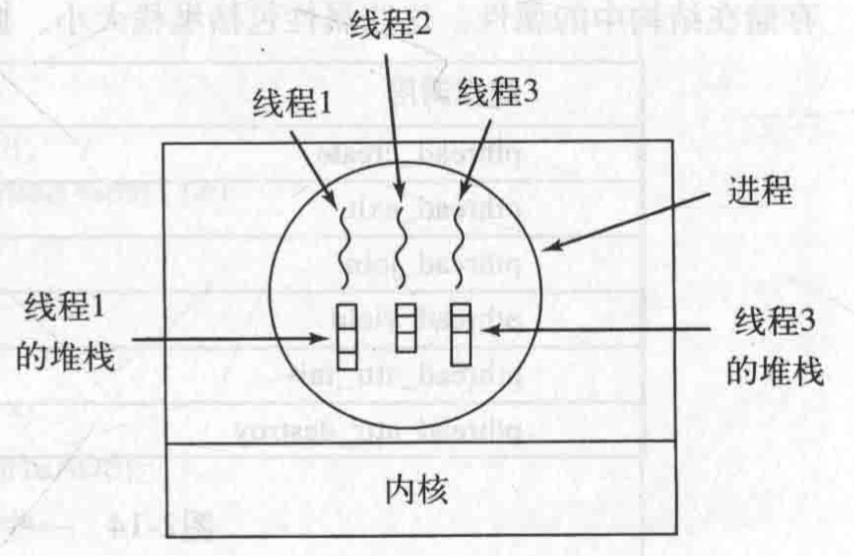

在多线程的情况下，进程通常会从当前的单个线程开始。这个线程有能力通过调用一个库函数（如thread_create）创建新的线程。thread_create的参数专门指定了新线程要运行的过程名。这里，没有必要对新线程的地址空间加以规定，因为新线程会自动在创建线程的地址空间中运行。有时，线程是有层次的，它们具有一种父子关系，但是，通常不存在这样一种关系，所有的线程都是平等的。不论有无层次关系，创建线程通常都返回一个线程标识符，该标识符就是新线程的名字

当一个线程完成工作后，可以通过调用一个库过程（如thread_exit）退出。该线程接着消失，不再可调度。在某些线程系统中，通过调用一个过程，例如thread_join，一个线程可以等待一个（特定）线程退出。**这个过程阻塞调用线程直到那个（特定）线程退出**。在这种情况下，线程的创建和终止非常类似于进程的创建和终止，并且也有着同样的选项

另一个常见的线程调用是thread_yield，它允许线程自动放弃CPU从而让另一个线程运行。这样一个调用是很重要的，因为不同于进程，（线程库）无法利用时钟中断强制线程让出CPU。所以设法使线程行为"高尚"起来，并且随着时间的推移自动交出CPU，以便让其他线程有机会运行，就变得非常重要

## POSIX线程

为实现可移植的线程程序，IEEE在IEEE标准1003.1c中定义了线程的标准。它定义的**线程包**叫作**pthread**。大部分UNIX系统都支持该标准。这个标准定义了超过60个函数调用，如果在这里列举一遍就太多了。这里仅描述一些主要的函数，以说明它是如何工作的。下图中列举了这些函数调用

所有 pthread线程都有某些特性。每一个都含有一个标识符、一组寄存器(包括程序计数器)和一组存储在结构中的属性。这些属性包括堆栈大小、调度参数以及其他线程需要的项目

    
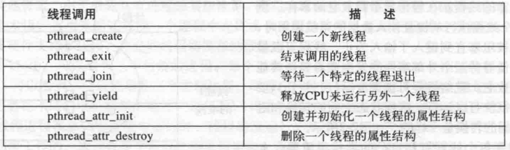

## 在用户空间中实现线程

把整个线程包放在用户空间中，内核对线程包一无所知。从内核角度考虑，就是按正常的方式管理，即单线程进程。这种方法第一个也是最明显的优点是，**用户级线程包可以在不支持线程的操作系统上实现**。过去所有的操作系统都属于这个范围，即使现在也有一些操作系统还是不支持线程

所有的这类实现都有同样的通用结构，如下图所示。线程在一个运行时系统的上层运行，该运行时系统是一个管理线程的过程的集合。前面已经介绍过其中的四个过程：pthread_create，pthread_exit，pthread_join和pthread_yield。不过，一般还会有更多的过程

    
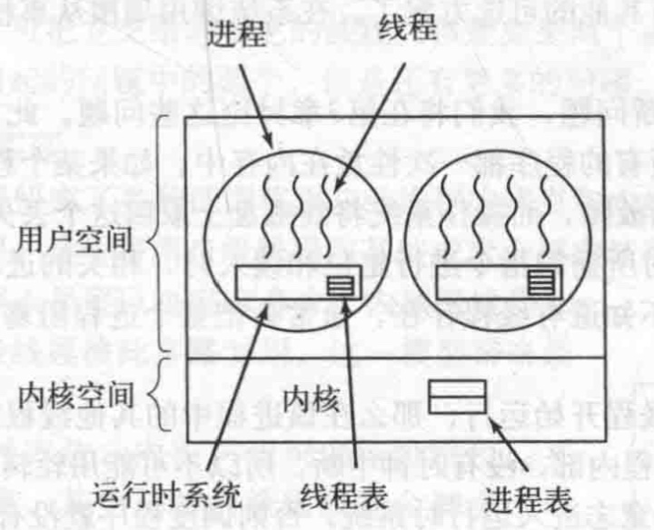

在用户空间管理线程时，每个进程需要有其专用的**线程表**（thread table），用来跟踪该进程中的线程。这些表和内核中的进程表类似，不过它仅仅记录各个线程的属性，如每个线程的程序计数器、堆栈指针、寄存器和状态等。该线程表由运行时系统管理。当一个线程转换到就绪状态或阻塞状态时，在该线程表中存放重新启动该线程所需的信息，与内核在进程表中存放进程的信息完全一样

当某个线程做了一些会引起在本地阻塞的事情之后，例如，等待进程中另一个线程完成某项工作它调用一个运行时系统的过程，这个过程检查该线程是否必须进人阻塞状态。如果是，它在线程表中保存该线程的寄存器（即它本身的），查看表中可运行的就绪线程，并把新线程的保存值重新装入机器的寄存器中。只要堆栈指针和程序计数器一被切换，新的线程就又自动投入运行。如果机器有一条保存所有寄存器的指令和另一条装入全部寄存器的指令，那么整个线程的切换可以在几条指令内完成。进行类似于这样的线程切换至少比陷入内核要快一个数量级（或许更多），这是使用用户级线程包的极大的优点

不过，线程与进程有一个关键的差别。在线程完成运行时，例如，在它调用thread_yield时，pthread_yield代码可以把该线程的信息保存在线程表中，进而，它可以调用线程调度程序来选择另一个要运行的线程。保存该线程状态的过程和调度程序都只是本地过程，所以启动它们比进行内核调用效率更高。另一方面，不需要陷入内核，不需要上下文切换，也不需要对内存高速缓存进行刷新，这就使得线程调度非常快捷

用户级线程还有另一个优点。它允许每个进程有自己定制的调度算法。例如,在某些应用程序中，那些有垃圾收集线程的应用程序就不用担线程会在不合适的时刻停止，这是一个长处。用户级线程还具有较好的可扩展性，这是因为在内核空间中内核线程需要一些固定表格空间和堆栈空间，如果内核线程的数量非常大，就会出现问题

尽管用户级线程包有更好的性能，但它也存在一些明显的问题。其中第一个问题是如何实现阻塞系统调用。假设在还没有任何击键之前，一个线程读取键盘。让该线程实际进行该系统调用是不可接受的，因为这会停止所有的线程。使用线程的一个主要目标是，首先要允许每个线程使用阻塞调用，但是还要避免被阻塞的线程影响其他的线程。有了阻塞系统调用，这个目标不是轻易地能够实现的

## 在内核中实现线程

现在考虑内核支持和管理线程的情形。如下图所示，此时不再需要运行时系统了。另外，每个进程中也没有线程表。相反，在内核中有用来记录系统中所有线程的线程表。当某个线程希望创建一个新线程或撤销一个已有线程时，它进行一个系统调用，这个系统调用通过对线程表的更新完成线程创建或撤销工作

    
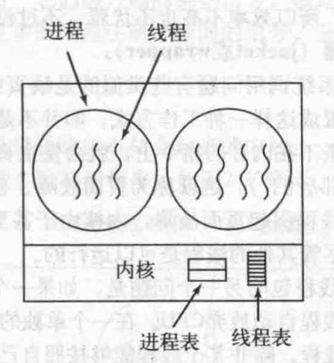

内核的线程表保存了每个线程的寄存器、状态和其他信息。这些信息和在用户空间中（在运行时系统中）的线程是一样的，但是现在保存在内核中。这些信息是传统内核所维护的每个单线程进程信息（即进程状态）的子集。另外，内核还维护了传统的进程表，以便跟踪进程的状态

所有能够阻塞线程的调用都以系统调用的形式实现，这与运行时系统过程相比，代价是相当可观的。当一个线程阻塞时，内核根据其选择，可以运行同一个进程中的另一个线程（若有一个就绪线程）或者运行另一个进程中的线程。而在用户级线程中，运行时系统始终运行自己进程中的线程，直到内核剥夺它的CPU（或者没有可运行的线程存在了）为止

由于在内核中创建或撤销线程的代价比较大，某些系统采取"环保"的处理方式，回收其线程。当某个线程被撤销时，就把它标志为不可运行的，但是其内核数据结构没有受到影响。稍后，在必须创建一个新线程时，就重新启动某个旧线程，从而节省了一些开销。在用户级线程中线程回收也是可能的但是由于其线程管理的代价很小，所以没有必要进行这项工作

内核线程不需要任何新的、非阻塞系统调用。另外，如果某个进程中的线程引起了页面故障，内核可以很方便地检查该进程是否有任何其他可运行的线程，如果有，在等待所需要的页面从磁盘读入时，就选择一个可运行的线程运行。这样做的主要缺点是系统调用的代价比较大，所以如果线程的操作（创建、终止等）比较多，就会带来很大的开销

虽然使用内核线程可以解决很多问题，但是也不会解决所有的问题。例如，当一个多线程进程创建新的进程时，会发生什么？新进程是拥有与原进程相同数量的线程，还是只有一个线程？在很多情况下，最好的选择取决于进程计划下一步做什么。如果它要调用exec来启动一个新的程序，或许一个线程是正确的选择，但是如果它继续执行，则最好复制所有的线程

另一个话题是信号。回忆一下，信号是发给进程而不是线程的，至少在经典模型中是这样的。当一个信号到达时，应该由哪一个线程处理它？线程可以"注册"它们感兴趣的某些信号，因此当一个信号到达的时候，可把它交给需要它的线程。但是如果两个或更多的线程注册了相同的信号，会发生什么？这只是线程引起的问题中的两个，但是还有更多的问题

## 混合实现

人们已经研究了各种试图将用户级线程的优点和内核级线程的优点结合起来的方法。一种方法是使用内核级线程，然后将用户级线程与某些或者全部内核线程多路复用起来，如下图所示。如果采用这种方法，编程人员可以决定有多少个内核级线程和多少个用户级线程彼此多路复用。这一模型带来最大的灵活度

    
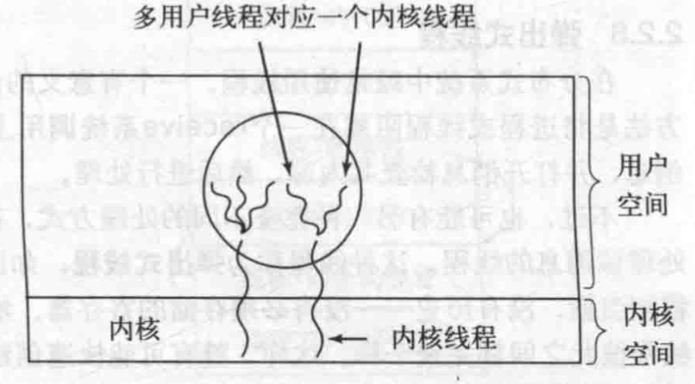

采用这种方法，内核只识别内核级线程，并对其进行调度。其中一些内核级线程会被多个用户级线程多路复用。如同在没有多线程能力操作系统中某个进程中的用户级线程一样，可以创建、撒销和调度这些用户级线程。在这种模型中，每个内核级线程有一个可以轮流使用的用户级线程集合

## 调度程序激活机制(？)

尽管内核级线程在一些关键点上优于用户级线程，但无可争议的是内核级线程的速度慢。因此，研究人员一直在寻找在保持其优良特性的前提下改进其速度的方法。下面将介绍Anderson等人（1992）设计的一种方法，称为**调度程序激活**（scheduler activation）机制。Edler等人（1988）以及Scott等人（1990）就相关的工作进行了深入讨论

调度程序激活工作的目标是模拟内核线程的功能，但是为线程包提供通常在用户空间中才能实现的更好的性能和更大的灵活性。特别地，如果用户线程从事某种系统调用时是安全的，那就不应该进行专门的非阻塞调用或者进行提前检查。无论如何，如果线程阻塞在某个系统调用或页面故障上，只要在同一个进程中有任何就绪的线程，就应该有可能运行其他的线程

由于避免了在用户空间和内核空间之间的不必要转换，从而提高了效率。例如，如果某个线程由于等待另一个线程的工作而阻塞，此时没有理由请求内核，这样就减少了内核-用户转换的开销。用户空间的运行时系统可以阻塞同步的线程而另外调度一个新线程

当使用调度程序激活机制时，内核给每个进程安排一定数量的虚拟处理器，并且让（用户空间）运行时系统将线程分配到处理器上。这一机制也可以用在多处理器中，此时虚拟处理器可能成为真实的CPU。分配给一个进程的虚拟处理器的初始数量是一个，但是该进程可以申请更多的处理器并且在不用时退回。内核也可以取回已经分配出去的虚拟处理器，以便把它们分给需要更多处理器的进程

使该机制工作的基本思路是，当内核了解到一个线程被阻塞之后（例如，由于执行了一个阻塞系统调用或者产生了一个页面故障），内核通知该进程的运行时系统，并且在堆栈中以参数形式传递有问题的线程编号和所发生事件的一个描述。内核通过在一个已知的起始地址启动运行时系统，从而发出了通知，这是对UNIX中信号的一种粗略模拟。这个机制称为**上行调用**（upcall）

一旦如此激活，运行时系统就重新调度其线程，这个过程通常是这样的：把当前线程标记为阻塞并从就绪表中取出另一个线程，设置其寄存器，然后再启动之。稍后，当内核知道原来的线程又可运行时（例如，原先试图读取的管道中有了数据，或者已经从磁盘中读入了故障的页面），内核就又一次上行调用运行时系统，通知它这一事件。此时该运行时系统按照自己的判断，或者立即重启动被阻塞的线程，或者把它放入就绪表中稍后运行

在某个用户线程运行的同时发生一个硬件中断时，被中断的CPU切换进内核态。如果被中断的进程对引起该中断的事件不感兴趣，比如，是另一个进程的I/O完成了，那么在中断处理程序结束之后，就把被中断的线程恢复到中断之前的状态。不过，如果该进程对中断感兴趣，比如，是该进程中的某个线程所需要的页面到达了，那么被中断的线程就不再启动，代之为挂起被中断的线程。而运行时系统则启动对应的虚拟CPU，此时被中断线程的状态保存在堆栈中。随后，运行时系统决定在该CPU上调度哪个线程：被中断的线程、新就绪的线程还是某个第三种选择

调度程序激活机制的一个目标是作为上行调用的信赖基础，这是一种违反分层次系统内在结构的概念。通常，n层提供n+1层可调用的特定服务，但是n层不能调用n+1层中的过程。上行调用并不遵守这个基本原理

# 进程间通信

进程经常需要与其他进程通信。例如，在一个shell管道中，第一个进程的输出必须传送给第二个进程，这样沿着管道传递下去。因此在进程之间需要通信，而且最好使用一种结构良好的方式而不要使用中断。下面来讨论一些有关**进程间通信**（**Inter-Process Communication，IPC**）的问题

简要地说，有三个问题。第一个问题与上面的叙述有关，即一个进程如何把信息传递给另一个。第二个要处理的问题是，确保两个或更多的进程在关键活动中不会出现交叉，例如，在飞机订票系统中的两个进程为不同的客户试图争夺飞机上的最后一个座位。第三个问题与正确的顺序有关（如果该顺序是有关联的话），比如，如果进程A产生数据而进程B打印数据，那么B在打印之前必须等待，直到A已经产生一些数据

有必要说明，这三个问题中的两个问题对于线程来说是同样适用的。第一个问题（即传递信息）对线程而言比较容易，因为它们共享一个地址空间（在不同地址空间需要通信的线程属于不同进程之间通信的情形）。但是另外两个问题（需要梳理清楚并保持恰当的顺序）同样适用于线程。同样的问题可用同样的方法解决。下面开始讨论进程间通信问题，不过请记住，同样的问题和解决方法也适用于线程。

## 竞争条件

在一些操作系统中，协作的进程可能共享一些彼此都能读写的公用存储区。这个公用存储区可能在内存中（可能是在内核数据结构中），也可能是一个共享文件

两个或多个进程读写某些共享数据，而最后的结果取决于进程运行的精确时序，称为竞争条件（race condition）。调试包含有竞争条件的程序是一件很头痛的事。大多数的测试运行结果都很好，但在极少数情况下会发生一些无法解释的奇怪现象。不幸的是，多核增长带来的并行使得竞争条件越来越普遍

## 临界区

怎样避免竞争条件？实际上凡涉及共享内存、共享文件以及共享任何资源的情况都会引发与前面类似的错误，要避免这种错误，关键是要找出某种途径来阻止多个进程同时读写共享的数据。换言之，我们需要的是**互斥**（mutual exclusion），即以某种手段确保当一个进程在使用一个共享变量或文件时，其他进程不能做同样的操作。前述问题的症结就在于，在进程A对共享变量的使用未结束之前进程B就使用它。为实现互斥而选择适当的原语是任何操作系统的主要设计内容之一

避免竞争条件的问题也可以用一种抽象的方式进行描述。一个进程的一部分时间做内部计算或另外一些不会引发竞争条件的操作。在某些时候进程可能需要访问共享内存或共享文件，或执行另外一些会导致竞争的操作。我们把对共享内存进行访问的程序片段称作**临界区域**（critical region）或**临界区**（criticalsection）。如果我们能够适当地安排，使得两个进程不可能同时处于临界区中，就能够避免竞争条件

尽管这样的要求避免了竞争条件，但它还不能保证使用共享数据的并发进程能够正确和高效地进行协作。对于一个好的解决方案，需要满足以下4个条件：

* **任何两个进程不能同时处于其临界区**
* **不应对CPU的速度和数量做任何假设**
* **临界区外运行的进程不得阻塞其他进程**
* **不得使进程无限期等待进入临界区**

## 忙等待的互斥

本节将讨论几种实现互斥的方案。在这些方案中，当一个进程在临界区中更新共享内存时，其他进程将不会进入其临界区，也不会带来任何麻烦

### 屏蔽中断

在单处理器系统中，最简单的方法是使每个进程在刚刚进入临界区后立即屏蔽所有中断，并在就要离开之前再打开中断。屏蔽中断后，时钟中断也被屏蔽。CPU只有发生时钟中断或其他中断时才会进行进程切换，这样，在屏蔽中断之后CPU将不会被切换到其他进程。于是，一旦某个进程屏蔽中断之后，它就可以检查和修改共享内存，而不必担心其他进程介入

这个方案并不好，因为把屏蔽中断的权力交给用户进程是不明智的。设想一下，若一个进程屏蔽中断后不再打开中断，其结果将会如何？整个系统可能会因此终止。而且，如果系统是多处理器（有两个或可能更多的处理器），则屏蔽中断仅仅对执行disable指令的那个CPU有效。其他CPU仍将继续运行，并可以访问共享内存

另一方面，对内核来说，当它在更新变量或列表的几条指令期间将中断屏蔽是很方便的。当就绪进程队列之类的数据状态不一致时发生中断，则将导致竞争条件。所以结论是：屏蔽中断对于操作系统本身而言是一项很有用的技术，但对于用户进程则不是一种合适的通用互斥机制

由于多核芯片的数量越来越多，即使在低端PC上也是如此。因此，通过屏蔽中断来达到互斥的可能性甚至在内核中变得日益减少了。双核现在已经相当普遍，四核当前在高端机器中存在，而且离八或十六（核）也不久远了。在一个多核系统中（例如，多处理器系统），屏蔽一个CPU的中断不会阻止其他CPU干预第一个CPU所做的操作。结果是人们需要更加复杂的计划

### 锁变量

作为第二种尝试，可以寻找一种软件解决方案。设想有一个共享（锁）变量，其初始值为0。当一个进程想进入其临界区时，它首先测试这把锁。如果该锁的值为0，则该进程将其设置为1并进入临界区。若这把锁的值已经为1，则该进程将等待直到其值变为0。于是，0就表示临界区内没有进程，1表示已经有某个进程进入临界区

但是，这种想法也包含了与假脱机目录一样的疏漏。假设一个进程读出锁变量的值并发现它为0，而恰好在它将其值设置为1之前，另一个进程被调度运行，将该锁变量设置为1。当第一个进程再次运行时，它同样也将该锁设置为1，则此时同时有两个进程进入临界区中

可能读者会想，先读出锁变量，紧接着在改变其值之前再检查一遍它的值，这样便可以解决问题。但这实际上无济于事，如果第二个进程恰好在第一个进程完成第二次检查之后修改了锁变量的值，则同样还会发生竞争条件

### 严格轮换法

第三种互斥的方法，在下中，整型变量turn，初始值为0，用于记录轮到哪个进程进人临界区，并检查或更新共享内存。开始时，进程0检查turn，发现其值为0，于是进入临界区。进程1也发现其值为0，所以在一个等待循环中不停地测试turn，看其值何时变为1。**连续测试一个变量直到某个值出现为止，称为忙等待**（busywaiting）。由于这种方式浪费CPU时间，所以通常应该避免。**只有在有理由认为等待时间是非常短的情形下，才使用忙等待**。**用于忙等待的锁，称为自旋锁**（**spin lock**）

    
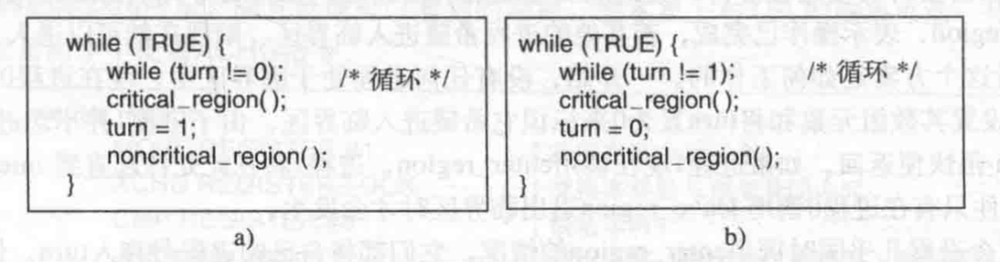

进程0离开临界区时，，它将turn的值设置为1，以便允许进程1进入其临界区。假设进程1很快便离开了临界区，则此时两个进程都处于临界区之外，turn的值又被设置为0。现在进程0很快就执行完其整个循环，它退出临界区，并将turn的值设置为1。此时，turn的值为1，两个进程都在其临界区外执行

突然，进程0结束了非临界区的操作并且返回到循环的开始。但是，这时它不能进入临界区，因为 turn的当前值为1，而此时进程1还在忙于非临界区的操作，进程0只有继续while循环，直到进程1把turn 的值改为0。**这说明，在一个进程比另一个慢了很多的情况下，轮流进人临界区并不是一个好办法**

这种情况违反了前面叙述的条件3：进程0被一个临界区之外的进程阻塞。尽管该算法的确避免了所有的竞争条件，但由于它违反了条件3，所以不能作为一个很好的备选方案

### Peterson解法

算法如下图所示，该算法由两个用ANSI C编写的过程组成

    
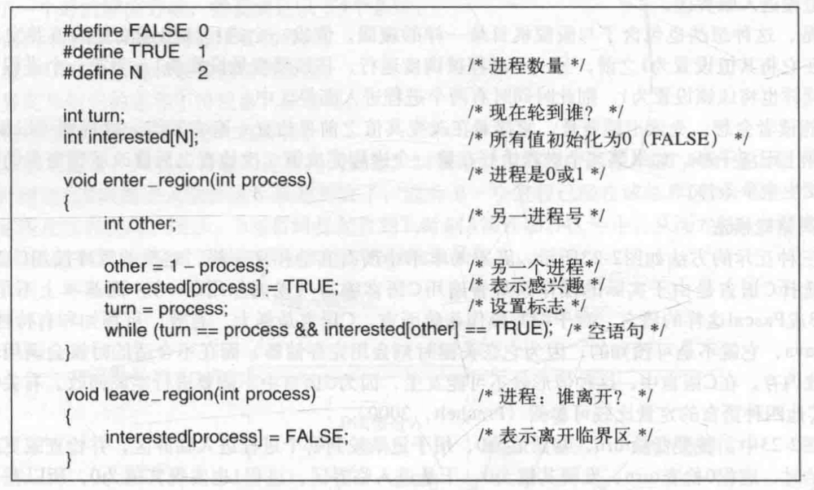

在使用共享变量（即进入其临界区）之前，各个进程使用其进程号0或1作为参数来调用enter_region。该调用在需要时将使进程等待，直到能安全地进入临界区。在完成对共享变量的操作之后，进程将调用leave_region，表示操作已完成，若其他的进程希望进入临界区，则现在就可以进入

现在来看看这个方案是如何工作的。一开始，没有任何进程处于临界区中，现在进程0调用enter region。它通过设置其数组元素和将turn置为0来标识它希望进入临界区。由于进程1并不想进人临界区，所以enter_region很快便返回。如果进程1现在调用enter_region，进程1将在此处挂起直到interested[0]变成FALSE，该事件只有在进程0调用leave_region退出临界区时才会发生

现在考虑两个进程几乎同时调用enter_region的情况。它们都将自己的进程号存入turn，但只有后被保存进去的进程号才有效，前一个因被重写而丢失。假设进程1是后存入的，则turn为1。当两个进程都运行到while语句时，进程0将循环0次并进人临界区，而进程1则将不停地循环且不能进入临界区，直到进程0退出临界区为止

### TSL指令

这是一种需要硬件支持的方案，那些多处理器计算机，都有这条指令：**TSL RX, LOCK**，称为**测试并加锁**（test and set lock）

这条指令如何防止两个进程同时进入临界区呢？解决方案如下图所示。假定（但很典型）存在如下共4条指令的汇编语言子程序。第一条指令将lock原来的值复制到寄存器中并将lock设置为1，随后这个原来的值与0相比较。如果它非零，则说明以前已被加锁，则程序将回到开始并再次测试。经过或长或短的一段时间后，该值将变为0（当前处于临界区中的进程退出临界区时），于是过程返回，此时已加锁。要清除这个锁非常简单，程序只需将0存入lock即可，不需要特殊的同步指令

    
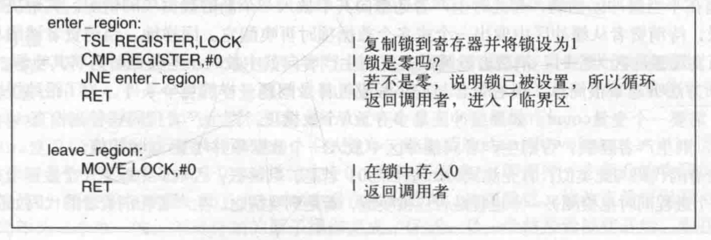

现在有一种很明确的解法了。进程在进入临界区之前先调用enter_region，，这将导致忙等待，直到锁空闲为止，随后它获得该锁并返回。在进程从临界区返回时它调用leave_region，这将把lock设置为0。与基于临界区问题的所有解法一样，**进程必须在正确的时间调用enter_region和leave_region，解法才能奏效。如果一个进程有欺诈行为，则互斥将会失败。换言之，只有进程合作，临界区才能工作**

一个可替代TSL的指令是XCHG，它原子性地交换了两个位置的内容，例如，一个寄存器与一个存储器字。代码如下图所示，而且就像可以看到的那样，它本质上与TSL的解决办法一样。所有的Intelx86 CPU在低层同步中使用XCHG指令

    
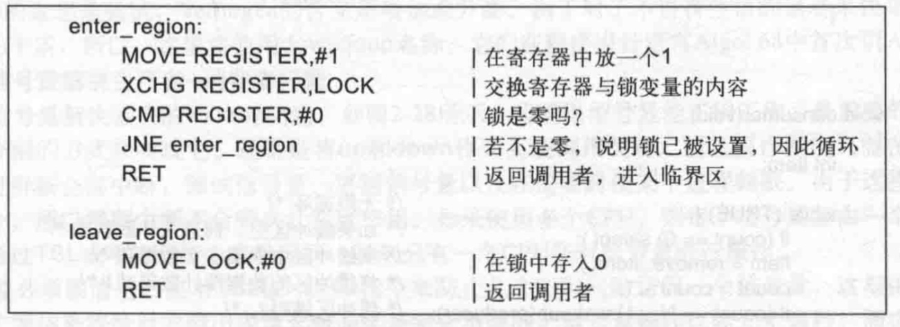

## 睡眠与唤醒

Peterson解法和TSL或XCHG解法都是正确的，但**它们都有忙等待的缺点**，**这些解法在本质上是这样的：当一个进程想进入临界区时，先检查是否允许进入，若不允许，则该进程将原地等待，直到允许为止**

这种方法不仅浪费了CPU时间，而且还可能引起预想不到的结果。考虑一台计算机有两个进程，H优先级较高，L优先级较低。调度规则规定，只要H处于就绪态它就可以运行。**在某一时刻，L处于临界区中，此时H变到就绪态，准备运行（例如，一条I/O操作结束）。现在H开始忙等待，但由于当H就绪时L不会被调度，也就无法离开临界区，所以H将永远忙等待下去**。这种情况有时被称作**优先级反转问题(priority inversion problem)**

**现在来考察几条进程间通信原语，它们在无法进人临界区时将阻塞，而不是忙等待**。**最简单的是sleep和wakeup。sleep是一个将引起调用进程阻塞的系统调用，即被挂起，直到另外一个进程将其唤醒**。**wakeup调用有一个参数，即要被唤醒的进程**。另一种方法是让sleep和wakeup各有一个参数，即有一个用于匹配sleep和wakeup的内存地址

作为使用这些原语的一个例子，我们考虑**生产者-消费者(producer-consumer)问题**，也称作**有界缓冲区**（bounded-buffer）问题。两个进程共享一个公共的固定大小的缓冲区。其中一个是生产者，将信息放入缓冲区，另一个是消费者，从缓冲区中取出信息。（也可以把这个问题一般化为m个生产者和n个消费者问题，但是这里只讨论一个生产者和一个消费者的情况，这样可以简化解决方案。）

问题在于当缓冲区已满，而此时生产者还想向其中放入一个新的数据项的情况。其解决办法是让生产者睡眠，待消费者从缓冲区中取出一个或多个数据项时再唤醒它。同样地，当消费者试图从缓冲区中取数据而发现缓冲区为空时，消费者就睡眠，直到生产者向其中放入一些数据时再将其唤醒

这个方法听起来很简单，但它包含竞争条件问题。为了跟踪缓冲区中的数据项数，需要一个变量count。如果缓冲区最多存放N个数据项，则生产者代码将首先检查count是否达到N，若是，则生产者睡眠，否则生产者向缓冲区中放入一个数据项并增量count的值

消费者的代码与此类似首先测试count是否为0，若是，则睡眠；否则从中取走一个数据项并递减count的值。每个进程同时也检测另一个进程是否应被唤醒，若是则唤醒之。生产者和消费者的代码如下图所示

    
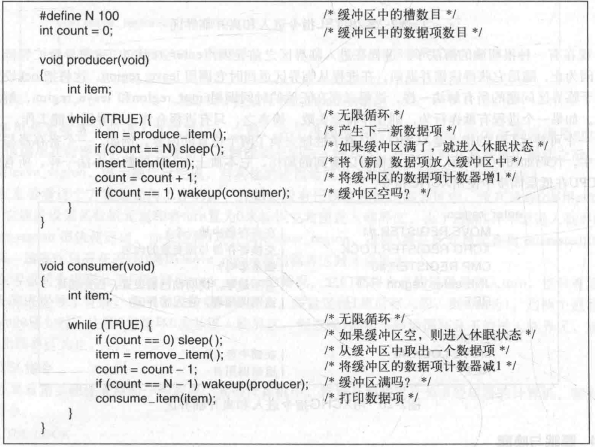

上图的代码含有严重竞争条件

其原因是对**count**的访问未加限制。有可能出现以下情况：**缓冲区为空，消费者刚刚读取count的值发现它为0。此时调度程序决定暂停消费者并启动运行生产者。生产者向缓冲区中加入一个数据项，count加1。现在count的值变成了1。它推断认为由于count刚才为0，所以消费者此时一定在睡眠，于是生产者调用wakeup来唤醒消费者**

**但是，消费者此时在逻辑上并未睡眠，所以wakeup信号丢失。当消费者下次运行时，它将测试先前读到的count值，发现它为0，于是睡眠。生产者迟早会填满整个缓冲区，然后睡眠。这样一来，两个进程都将永远睡眠下去** (两段代码可以同时执行)

问题的实质在于发给一个（尚）未睡眠进程的wakeup信号丢失了。如果它没有丢失，则一切都很正常。一种快速的弥补方法是修改规则，加上一个唤醒等待位。当一个wakeup信号发送给一个清醒的进程信号时，将该位置1。随后，当该进程要睡眠时，如果唤醒等待位为1，则将该位清除，而该进程仍然保持清醒。唤醒等待位实际上就是wakeup信号的一个小仓库

尽管在这个简单例子中用唤醒等待位的方法解决了问题，但是我们可以很容易就构造出一些例子其中有三个或更多的进程，这时一个唤醒等待位就不够使用了。于是我们可以再打一个补丁，加入第二个唤醒等待位，甚至是8个、32个等，但原则上讲，这并没有从根本上解决问题

## 信号量

信号量是E.W.Dijkstra在1965年提出的一种方法，它使用一个整型变量来累计唤醒次数，供以后使用。在他的建议中引入了一个新的变量类型，称作**信号量**（**semaphore**）。一个信号量的取值可以为0（表示没有保存下来的唤醒操作）或者为正值（表示有一个或多个唤醒操作）

Dijkstra建议设立两种操作：down和up（分别为一般化后的sleep和wakeup）。对一信号量执行down操作，则是检查其值是否大于0。若该值大于0，则将其值减1（即用掉一个保存的唤醒信号）并继续；若该值为0，则进程将睡眠，而且此时down操作并未结束。**检查数值、修改变量值以及可能发生的睡眠操作均作为一个单一的、不可分割的原子操作完成**。**保证一旦一个信号量操作开始，则在该操作完成或阻塞之前，其他进程均不允许访问该信号量**。**这种原子性对于解决同步问题和避免竞争条件是绝对必要的**。**所谓原子操作，是指一组相关联的操作要么都不间断地执行，要么都不执行**。原子操作在计算机科学的其他领域也是非常重要的

up操作对信号量的值增1。如果一个或多个进程在该信号量上睡眠，无法完成一个先前的down操作，则由系统选择其中的一个（如随机挑选）并允许该进程完成它的down操作。**于是，对一个有进程在其上睡眠的信号量执行一次up操作之后，该信号量的值仍旧是0，但在其上睡眠的进程却少了一个**(其实就是调度了下一个进程)。**信号量的值增1和唤醒一个进程同样也是不可分割的**。不会有某个进程因执行up而阻塞，正如在前面的模型中不会有进程因执行wakeup而阻塞一样

顺便提一下，在Dijkstra原来的论文中，他分别使用名称**P**和**V**而不是down和up，荷兰语中，Proberen的意思是尝试，Verhogen的含义是增加或升高。由于对于不讲荷兰语的读者来说采用什么记号并无大的干系，所以，这里将使用down和up名称。它们在程序设计语言Algol68中首次引入

---

**用信号量解决生产者-消费者问题**

**用信号量解决丢失的wakeup问题，如下图所示**。为确保信号量能正确工作，最重要的是要采用一种不可分割的方式来实现它。**通常是将up和down作为系统调用实现，而且操作系统只需在执行以下操作时暂时屏蔽全部中断：测试信号量、更新信号量以及在需要时使某个进程睡眠**。由于这些动作只需要几条指令，所以屏蔽中断不会带来什么副作用。如果使用多个CPU，则每个信号量应由一个锁变量进行保护。通过TSL或XCHG指令来确保同一时刻只有一个CPU在对信号量进行操作

读者必须搞清楚，使用TSL或XCHG指令来防止几个CPU同时访问一个信号量，这与生产者或消费者使用忙等待来等待对方腾出或填充缓冲区是完全不同的。信号量操作仅需几个毫秒，而生产者或消费者则可能需要任意长的时间

该解决方案使用了三个信号量：一个称为**full**，用来记录充满的缓冲槽数目，一个称为**empty**，记录空的缓冲槽数目，一个称为**mutex**，用来确保生产者和消费者不会同时访问缓冲区。full的初值为0，empty的初值为缓冲区中槽的数目，mutex初值为1。供两个或多个进程使用的信号量，其初值为1，保证同时只有一个进程可以进入临界区，称作**二元信号量**（binary semaphore）。如果每个进程在进人临界区前都执行一个down操作，并在刚刚退出时执行一个up操作，就能够实现**互斥**

    
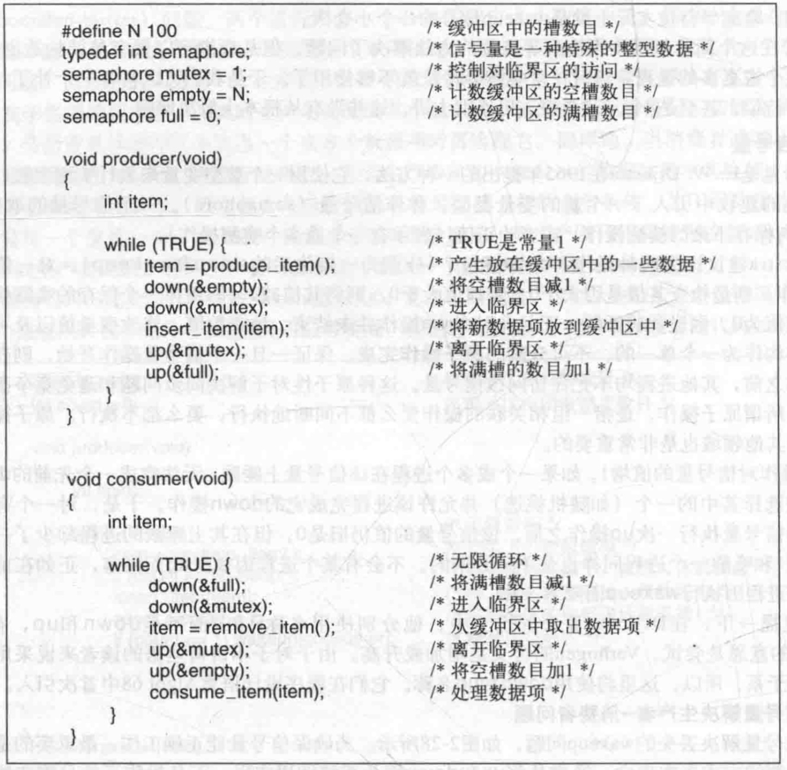

这个例子实际上是通过两种不同的方式来使用信号量的，它们之间的区别很重要。**信号量mutex用于互斥，它用于保证任一时刻只有一个进程读写缓冲区和相关的变量**。**互斥是避免混乱所必需的操作**

**信号量的另一种用途是用于实现同步(synchronization)**。**信号量full和empty用来保证某种事件的顺序发生或不发生。在本例中，它们保证当缓冲区满的时候生产者停止运行，以及当缓冲区空的时候消费者停止运行。这种用法与互斥是不同的**

## 互斥量

如果不需要信号量的计数能力，有时可以使用信号量的一个简化版本，称为**互斥量**（mutex）。互斥量仅仅适用于管理共享资源或一小段代码。由于互斥量在实现时既容易又有效，这使得互斥量在实现用户空间线程包时非常有用

互斥量是一个可以处于两态之一的变量：**解锁和加锁**。这样，只需要一个二进制位表示它，不过实际上，常常使用一个整型量，**0表示解锁**，而其他所有的值则表示加锁。互斥量使用两个过程。当一个线程(或进程)需要访问临界区时，它调用 **mutex_lock**。如果该互斥量当前是解锁的(即临界区可用)，此调用成功，调用线程可以自由进入该临界区

另一方面，如果该互斥量已经加锁，调用线程被阻塞，直到在临界区中的线程完成并调用**mutex_unlock**。如果多个线程被阻塞在该互斥量上，将随机选择一个线程并允许它获得锁

由于互斥量非常简单，所以如果有可用的TSL或XCHG指令，就可以很容易地在用户空间中实现它们。用于用户级线程包的**mutex_lock**和**mutex_unlock**代码如下图所示

    
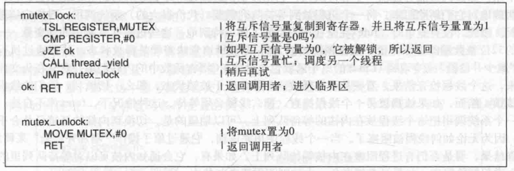

mutex_lock的代码与先前enter_region的代码很相似，**但有一个关键的区别。当enter_region进入临界区失败时，它始终重复测试锁（忙等待）。实际上，由于时钟超时的作用，会调度其他进程运行。这样迟早拥有锁的进程会进入运行并释放锁**

**在（用户）线程中，情形有所不同，因为没有时钟停止运行时间过长的线程。结果是通过忙等待的方式来试获得锁的线程将永远循环下去，决不会得到锁，因为这个运行的线程不会让其他线程运行从而释放锁**

### pthread中的互斥量

Pthread提供许多可以用来同步线程的函数。其基本机制是使用一个可以被锁定和解锁的互斥量来保护每个临界区。一个线程如果想要进入临界区，它首先尝试锁住相关的互斥量。如果互斥量没有加锁，那么这个线程可以立即进入，并且该互斥量被自动锁定以防止其他线程进入。如果互斥量已经被加锁，则调用线程被阻塞，直到该互斥量被解锁。如果多个线程在等待同一个互斥量，当它被解锁时，这些等待的线程中只有一个被允许运行并将互斥量重新锁定。这些互斥锁不是强制性的，而是由程序员来保证线程正确地使用它们

创建和撤销互斥量，实现它们的函数调用分别是**pthread_mutex_init**与**pthread_mutex_destory**

给互斥量加锁和解锁，使用**pthread_mutex_lock**和**pthread_mutex_unlock**

除互斥量之外，pthread提供了另一种同步机制：**条件变量**。互斥量在允许或阻塞对临界区的访问上是很有用的，**条件变量则允许线程由于一些未到达的条件而阻塞**。绝大部分情况下这两种方法时一起使用的

    
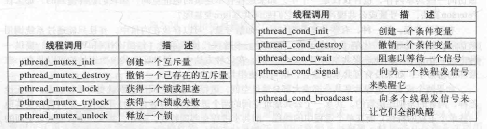

下面的例子使用互斥量和条件变量解决生产者-消费者问题

一个线程将产品放在一个缓冲区内，由另一个线程将它们取出。如果生产者发现缓冲区没有空槽可以使用了，它不得不阻塞起来直到有一个空槽可以使用。生产者使用互斥量可以进行原子性检查，而不受其他线程干扰。**但是当发现缓冲区已经满了以后，生产者需要一种方法来阻塞自己并在以后被唤醒。这就是条件变量做的事了**

条件变量的主要操作是**pthread_cond_wait**和**pthread_cond_signal**，前者阻塞调用线程直到另一其他线程向它发信号(使用后一个调用)。被阻塞的线程经常是在等待发信号的线程去做某些工作、释放某些资源或是进行其他的一些活动。只有完成后，被阻塞的线程才可以继续进行。条件变量允许这种等待与阻塞原子性地进行。当有多个线程被阻塞并等待同一个信号时，可以使用pthread_cond_bodadcast调用

    
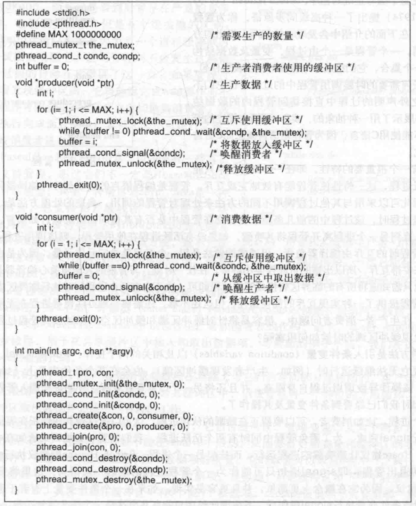

